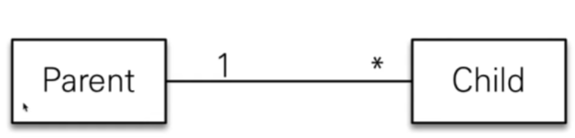
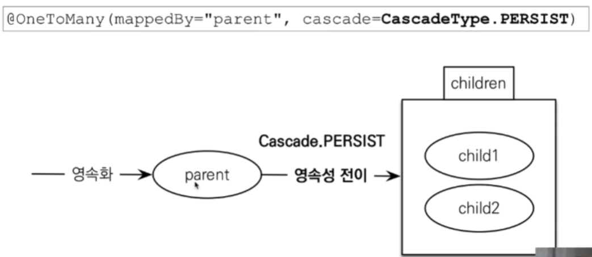
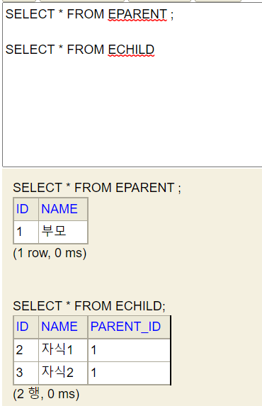
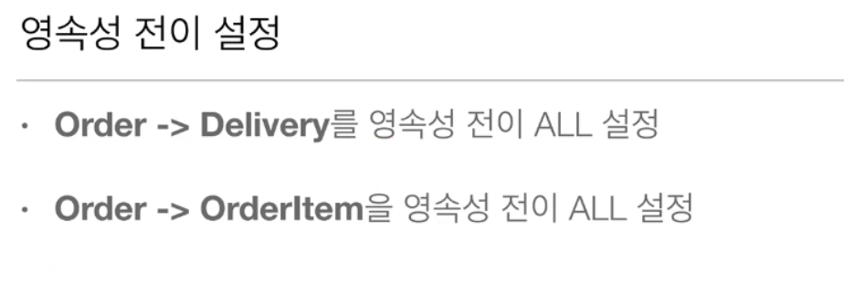
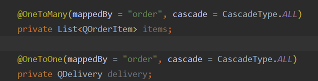

📌 영속성 전이
-
* 엔티티를 저장할 때(영속 상태로 만들 때), 연관관계에 있는 엔티티도 함께 영속상태로 만들지 말지, 그리고 준영속 상태가 될 때 연관된 엔티티도 준영속 상태로 만들지 말지 결겅하기 위해 사용하는 옵션

* ex) Parent 엔티티를 저장할 때 Child 엔티티도 함께 저장을 한다.


<br/>

📌 고아 객체
-
* orphanRemoval = true 옵션을 주면 부모와 자식 관계가 끊어지는 것을 관찰해서, 끊어진 경우 자동으로 delete 쿼리를 날려줍니다.
* 이를 관계가 끊어져 delete 될 entity를 고아객체라고 부릅니다.


<br/>

📌 영속성 전이 + 고아 객체
-
* CascadeType.All + orphanRemoval = true 옵션을 같이 사용하는 것 
* 두 옵션을 모두 활성화 함으로써, 부모 엔티티를 통해서 자식의 생명주기 까지 관리할 수 있게 됨 
* 이는, 자식 엔티티를 다른 여러 엔티티가 공유 하지 않고 오직 하나의 부모 엔티티에 속할 경우에만 사용해야 한다.
    * 보드 내부에 선택을 통해 넣고 빼는 1회성 객체
* 도메인 주도 설계(DDD)의 Aggregate Root 의 개념을 구현할 때 유용하게 사용
    * Aggregate Root 가 아닌 것은 레파지토리를 생성하지 않는다는 개념 같은게 있음

> 영속성 전이의 저장


* [참고](./cascade/Run.java)
```java
EParent parent = new EParent();
parent.setName("부모");

EChild child1 = new EChild();
child1.setName("자식1");
child1.setParent(parent);

EChild child2 = new EChild();
child2.setName("자식2");
child2.setParent(parent);

parent.getChildList().add(child1);
parent.getChildList().add(child2);
System.out.println("영속성 저장");
entityManager.persist(parent);
```


* 부모만 persist 했는데 자식까지 persist 되었다.


> 영속성 전이 삭제
* [참고](./diff/Run.java)
```java
EEParent parent1 = entityManager.find(EEParent.class, parent.getId());
RRParent parent2 = entityManager.find(RRParent.class, Rparent.getId());

System.out.println("orphanRemoval = true 인 경우 자식과 연관관계가 끊어지면 자동으로 삭제가 됩니다");
parent2.getChildList().remove(0);

System.out.println("부모가 삭제되면 자식도 삭제되는 것은 동일합니다.");
entityManager.remove(parent2);

System.out.println("cascade REMOVE 인 경우. child를 remove 해도 연관 객체가 끊어져도 delete 쿼리가 나가지 않습니다.");
parent1.getChildList().remove(0);

System.out.println("그러나 부모가 삭제되면 연관 객체를 삭제하는 동작은 orphanRemoval = true 상태와 동일합니다. 다만, 주의할 점은 자식을 제거한 채로 PARENT Entity를 remove 하려고 하면 하나 남아있는 자식 객체에는 remove 가 영속성 전이 되지 않기 때문에 무결성 제약 조건 에러가 발생합니다.");
entityManager.remove(parent1);
```
* orphanRemoval = true 와 cascade = CascadeType.REMOVE 의 공통점과 차이점
    * 공통점
        * parent 가 remove 되면 child 도 같이 remove 를 합니다. (이 때, parent 영속성 객체 기준으로 현재 add 되어 있는 child 만 romove 하기 때문에 영속성 전이 때문에 무결성 제약 조건 예외가 발생할 수 있습니다.)
    * 차이점
        * orphanRemoval = true 는 연관 관계가 있는 객체의 변화를 관찰하고 있기 때문에 관계가 끊어지면 자동으로 delete 쿼리를 날립니다.
        * cascade = CascadeType.REMOVE 는 연관 관계가 있는 객체의 변화를 관찰하지 않기 때문에 관계가 끊어져도 delete 쿼리를 날리지 않습니다.
* 주의할 점
    * cascade = CascadeType.REMOVE 를 사용할 때는 child 를 remove 해도, delete 쿼리가 나가지 않습니다. child(A 라고 가정) 를 하나 제거한 상태로 parent를 remove 하면 A는 delete 하지 않은 채, parent를 delete 할 것이고 이 때문에 무결성 제약 조건 예외가 발생할 확률이 있습니다.


> 실저 예제



* [참고](../Fifth/실전예제/QOrder.java "")


<br/>

