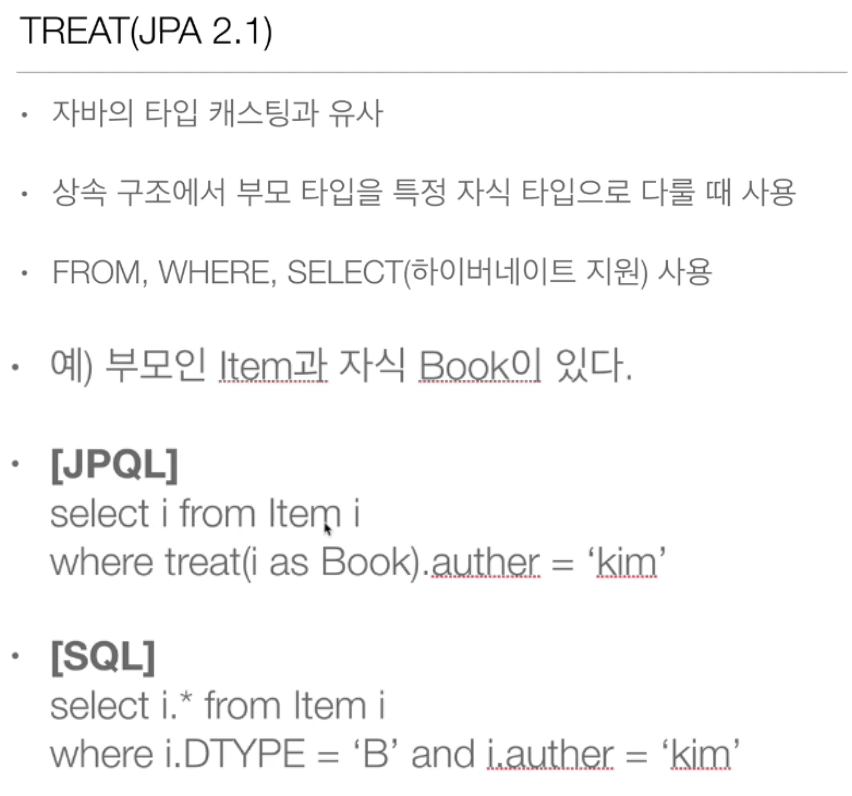

📌 경로 표현식
-
* 점(.)을 찍어 객체 그래프를 탐색하는 것

* 어떤 경로를 탐색하는 지에 따라서 나오는 SQL 의 모양이 달라진다.


> 경로 표현식 특징
* 상태 필드 : 경로 탐색의 끝
* 단일 값 연관 필드 : 묵시적 조인이 발생(*)
* 컬렉션 값 연관 필드 : 묵시적 조인이 발생하지 않고, 경로 탐색의 끝입니다.
    * From 절에서 명시적 조인을 통해, 별칭을 부여하면 경로 탐색이 가능해집니다.


> 단일 값 연관 경로


* 묵시적인 내부 조인이 발생
* [참고](single/Run.java)
* 쿼리 튜닝 문제로 묵시적 조인이 발생할 수 있는 쿼리는 사용하지 않는 것이 좋고, 명시적으로 해주어야 합니다.
    * select t from AMember m join m.team t (select m.team from AMember m join m.team t)

> 컬렉션 값 연관 경로
* [참고](./collection/Run.java)
* 묵시적 내부 조인이 발생
* size를 제외하면 거의 탐색할 수 있는 것도 없다.
* 이 때 명시적으로 조인을 해서 별칭을 부여하면 경로 탐색이 가능

> 실무 조언
* 가급적 묵시적 조인 대신 명시적 조인 사용
* 조인은 SQL 의 중요 포인트
* 묵시적 조인은 조인이 일어나는 상황을 한눈에 파악하기 어려움


<br/>

📌 fetch 조인
-
* [참고](./fetch/Run.java)
* SQL 의 한 종류가 아닙니다.
* JPQL에서 성능 최적화를 하기 위해 제공하는 기능입니다.
* 연관된 엔티티나, 컬렉션을 SQL 한번에 조회하는 기능
* join fetch 형태로 사용
* 패치 조인 ::= [LEFT [OUTER]| INNER] JOIN FETCH 조인 경로


> 엔티티 페치 조인
* 회원을 조회하면서 연관된 팀도 함께 조회
* SQL을 보면 회원 뿐만 아니라, 팀(T.*)도 함께 조회
* JPQL
```sql
select m from Member m join fetch m.team
```
* SQL
```sql
SELECT 
	M.*
	, T.* 
FROM MEMBER M 
	INNER JOIN TEAM T 
	ON M.TEAM_ID = T.ID
```

* 동작 방법은 그냥 join과 동일하다.
* 다만, select 절에 모든 관련 데이터를 조회 (엔티티가 있는 경우 join을 해서 데이터를 전부 가져옴)한다는 점이 특징적이다.
* 지연로딩으로 설정을 해두어도 즉시로딩으로 데이터를 가져온다. (일반 조인의 경우 엔티티를 명시하지 않으면 엔티티 객체는 프록시로 가져온다.)


> 컬렉션 페치 조인
* 다대일로 시작하는 페치 조인은 전혀 문제가 될 것이 없지만, 일대다 페치 조인은 데이터의 중복이 발생한다. (컬렉션의 경우 일대다)
* JPQL
    * select t from Team t join fetch t.members where t.name = 'A'
* SQL
    * select t.*, m.* from Team t inner join member m on t.id = m.team_id where t.name = 'A'
* => 이는 팀 데이터가 중복이 됩니다. (DB에서는 팀 1개 + 멤버 1개를 결합한 데이터를 반환하지만, 엔티티는 팀 1개에 할당 된 모든 멤버를, DB에서 반환한 row 수만큼 가지고 있기 때문이다. 그림참고)

* 엔티티 결과를 보면, JPA는 DB에서 반환한 2줄의 데이터를 그대로 반환해야 하기 때문에 같은 팀A를 바라보는 엔티티가 2개 생기는 것이다.
* 엔티티를 출력해보면 팀 1개 + 멤버 1개가 묶인 상태가 아니라, 팀 1개에 멤버 2명이 묶인 2개의 중복 데이터가 출력됩니다. (DB가 2줄을 반환했기 때문에 JPA가 임의로 값을 줄여버릴 수 없기 때문에 이런일이 발생)

* 따라서 이는 중복 제거의 필요성이 있음 


> 페치 조인과 distinct
* SQL의 distinct는 중복 된 row를 제거하는 명령
* JPQL 에서 distinct 는 2가지 기능을 제공
    1. SQL에 distinct 추가
    2. 애플리케이션에서 엔티티 중복 제거
* 1번의 경우 데이터가 완전히 중복 되어야 제거가 가능하기 때문에 위와 같은 케이스에서는 제거할 방법이 없음
* 허나 2번의 경우 에플리케이션 단에서 데이터가 중복 되기 때문에 1줄로 값을 줄어줍니다. => 영속성 컨텍스트 내부에 중복된 값을 줄여준다는 의미

> 페치 조인 정리
* 데이터를 조인해서 연관 데이터를 한번에 가져오는 것을 의미
* 다대일은 데이터 중복 문제가 발생하지 않지만, 일대다는 데이터 중복 문제가 발생

* N + 1 문제 또한 일대다에서 발생하는 문제점 입니다. (일대다는 기본이 레이지 로딩이기 때문에 m을 프록시로 가져옴)
* 즉시 로딩일 때는 join을 사용하지 않은 경우 N + 1 문제를 발생 시킵니다.
* 이와 같은 문제를 페치 조인을 통해서 해결할 수 있습니다.
* 페치 조인은 객체 그래프를 SQL에 한번에 조회하는 개념(즉시 로딩)
* 여러 테이블을 조인해서 엔티티가 가진 모양이 아니라 전혀 다른 모양의 결과를 내야한다면, 페치 조인 보다는 일반 조인을 한 뒤에 원하는 데이터만 DTO로 반환하는 것이 효과적 

> 페치 조인의 특징과 한계
* 패치 조인 대상에는 별칭을 줄 수 없다.
    * 하이버네이트는 사용 가능하나 가급적 사용 X
* 둘 이상의 컬렉션은 페치 조인 할 수 없음 
* 컬렉션을 페치 조인하면, 페이징 API를 사용할 수 없다. (특히 일대다에서 페이징을 사용하면, 중복 데이터라서 의미가 없어집니다.)
    * 하이버네이트의 경우, 경고 로그를 남기고 모든 데이터를 가져온 뒤 메모리에서 페이징 하는데 이는 매우매우 위험합니다.
* 연관된 엔티티들을 SQL 한번에 조회하므로 성능 최적화를 할 수 있다.
* 엔티티에 직접 적용하는 글로벌 전략보다 우선이다.
    * fetch = FetchType.LAZY // 글로벌 전략
* 실무에선 글로벌 전략은 모두 LAZY 이고 일대다에서는 fetch join으로 즉시 로딩
* 페치 조인은 별도의 별칭을 주지 않는 것이 좋다.
    * 특히, 패치 조인의 별칭을 통해서 where 조건을 거는 것은 더욱 더 좋지 않다.
    * 연관 된 것들을 다 끌고 오겠다는 말인데, 조인된 대상으로 조건을 걸면 JPA의 의도와 다르게 동작해서 문제가 될 수 있음
    * 위와 같은 상황이 꼭 필요하다면, 별도의 2개의 쿼리로 날리는 것이 맞다.

> 페치 조인의 페이징 문제 해결
1. 페치 조인의 경우 일대다인 경우 페이징 문제가 발생하는 것이므로, 다대일 쪽에서 select 해서 페이징 하는 방향으로 해결한다. 
2. 또는 배치 사이즈를 이용해서 해결

    * members 를 조회할 때 테이블에 select 쿼리를 모아 in으로 한번에 나가는 것이다.
    
    * 위 설정은 엔티티 개인 설정이고, 보통은 글로벌 설정으로 많이 가져간다. 
    


<br/>





<br/>


📌 조건으로 엔티티 vs 키 값 사용
-


* where 부분의 member 엔티티를 조건으로 건 부분이 id로 변경 되어 있다.


* 조건으로 id를 명시했으면 id를 엔티티를 명시했으면 엔티티를 넣어야 한다.

 
* 이것은 외래키를 사용할 때에도 전혀 문제가 없다.


<br/>

📌 Named 쿼리
-


* 쿼리에 이름을 부여해두고 사용할 수 있음
* 정적 쿼리이기 때문에 필요할 때 where을 추가하는 등의 행동은 할 수 없음
* 대신 애플리케이션 로딩 시점에 쿼리에 오류가 있을 경우 감지해줌 
* 어노테이션에 사용하는 방법 & xml에 정의해두고 불러와 사용하는 방법이 있음

    * xml이 항상 우선순위가 높다.
    * 애플리케이션 환경에 따라 다른 xml 을 사용하는 것이 가능해진다.
    * Spring Data JPA 를 사용하면 아래와 같이 이름 없는 named 쿼리 사용이 가능 (특징은 Named 쿼리와 동일)
    


<br/>


📌 벌크 연산
-
* 값을 한번에 insert, delete, update 하는 것
* 아래와 같은 상황을 실행해야 한다고 가정
    * 재고가 10개 미만인 모든 상품 가격을 10% 인상
* JPA 변경 감지로 하기엔 너무 방대한 작업 
    * 따라서 SQL 쿼리를 직접 DB에 날릴 필요 있음
    * JPQL 에서도 위와 같은 동작을 지원

> 벌크 연산 예제


* 하이버 네이트의 경우 select 해서 insert 하는 것도 지원

> 모든 회원의 나이를 20살로 변경한다면?


> 벌크 연산 시 주의할 점
* 벌크 연산은 영속성 컨텍스트와 아무런 관련 없이 동작하는 연산임
* 즉, 벌크 연산을 했을 때 적절한 타이밍에 flush는 자동으로 나가나, clear를 해주지 않으면 영속성 컨텍스트에 있는 값을 그대로 사용할 가능성이 있음(또는 update, delete 된 내용이 반영되지 상태로 값을 가져옵니다)

* update 를 수행 했는데도 age 가 0 입니다. clear를 수행하지 않았기 때문입니다.


