📌 연관관계 이해
-
* 방향 : 단방향, 양방향
* 다중성 : 다대일, 일대다, 일대일, 다대다
* 연관관계의 주인 : 객체의 경우, 양방향으로 연관관계가 맺어질 수 있기에 연관관계의 주인이 필요


<br/>

📌 예제를 통해서 확인
-
> 예제 시나리오
* 회원과 팀이 있다.
* 회원은 하나의 팀에만 소속될 수 있다.
* 회원과 팀은 다대일 관계이다.   
=> 하나의 팀에 여러 회원이 있을 수 있으나, 회원 입장에서는 하나의 팀에 밖에 못들어 가는 것


<br/>

> 모델링

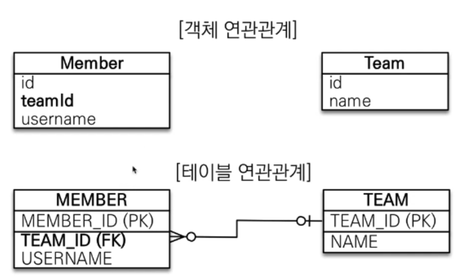
* 데이터 중심의 모델링의 문제점은 teamId라는 값을 사용하기 때문에 member에서 team 을 가져오는 것이 매우 어렵다.

> 테이블과 객체 매핑 사이의 큰 차이점
* 테이블은 외래키로 조인을 사용해서 연관된 테이블을 찾는다 => 컬럼 데이터 중심
* 그러나 객체는 참조를 사용해서 연관된 객체를 찾는다 => 객체 중심

* 이전에 설계했던 모델링과 다르게 데이터 중심이 아닌 객체 중심으로 설계를 해본다!

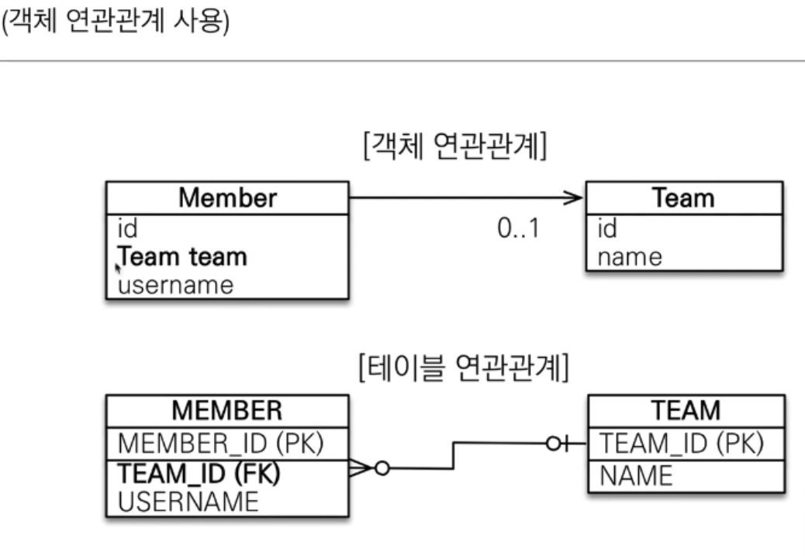
* teamId가 아니라, team을 사용해서 객체의 연관관계를 설정했다.

> Member
```java
@Entity
public class TMember {
    @Id
    private Long id;
    @ManyToOne
    @JoinColumn(name = "TTEAM_ID")
    private TTeam team;
    private String username;
}
```
> Team
```java
@Entity
public class TTeam {
    @Id
    private Long id;
    private String name;
}
```
* 이제 멤버에서 팀을 찾아오는 코드는 아래와 같이 심플하게 바뀌었다.
* [Run.java](./Run.java)
* 다대일의 경우에는 @JoinColumn(name = "TTEAM_ID") 을 사용하지 않아도 문제는 없다.

<br/>

📌 문제점
-
* 위에서는 단방향(멤버에서 팀으로) 매핑을 맺었다. 그런데, 이를 양방향으로 맺어서 team 으로 부터 member를 찾아오게 할 수 있다. 
* 양방향 매핑을 하면, team 에서 member로 member에서 team으로 쉽게 이동할 수 있지만, 아래와 같은 경우에서 어떻게 해야할지 애매해진다.
    * team 에서 member를 변경했을 때 update
    * member 에서 team을 변경했을 때 update
> Team 변경점
```java
@Entity
public class TTeam {

    @Id
    private Long id;

    private String name;

    // 이부분 추가        
    @OneToMany(mappedBy = "team")
    private List<TMember> members = new ArrayList();
}
```
* @OneToMany 어노테이션을 통해서 양방향 매핑을 완성하였다. 이제 Team 에서 member를 찾아오는 것도 가능해졌다.
* mappedBy 를 사용해준 이유는, 이 필드가 연관관계의 주인이 아님을 나타내는 것이다. 자세한 설명은 후술
* new ArrayList를 사용한 이유는 team에 member를, add를 할 때 NullPointException이 뜨는 것을 방지하기 위함이다. 


<br/>

📌 mappedBy
-
* 객체는 연관관계가 양쪽으로 방향성을 띄지만, 테이블에서는 방향성이라는게 없다. 그저 member 테이블이 team pk를 fk로 사용하고 있다는 사실 뿐이다.
* 만약 member 의 team을 수정하려면 테이블에서 member는 team 값을 하나만 수정하면 그만이지만, jpa 에서는 team 에서 member를 수정하나, member에서 team을 수정하나 update 가 가능하다.
* 그러나 이와 같은 동작은 개발자에게 혼란을 줄 뿐이다. 
* 따라서 mappedBy 속성을 통해서 연관관계의 주인이 누구인지 명시를 해주고 주인만 관리(등록, 수정) 할 수 있도록 한다.


<br/>


📌 연관관계의 주인 (양방향 매핑 규칙)
-
* 객체의 두 관계 중 하나를 연관관계의 주인으로 지정
* 연관관계의 주인만 외래 키를 관리 (등록, 수정)
* 주인이 아닌 쪽은 읽기만 가능 
* 주인은 mappedBy 속성 사용 X
* 주인이 아니면 mappedBy 속성으로 주인 지정


<br/>

📌 연관관계의 주인 결정 (권장사항)
-
* team을 수정했는데 member 에 쿼리가 날아간다는 것은 객체지향의 관점으로 봤을 때도 맞지 않는 것 같다. 
* 따라서 외래키를 사용하는 쪽을 주인으로 정한다.
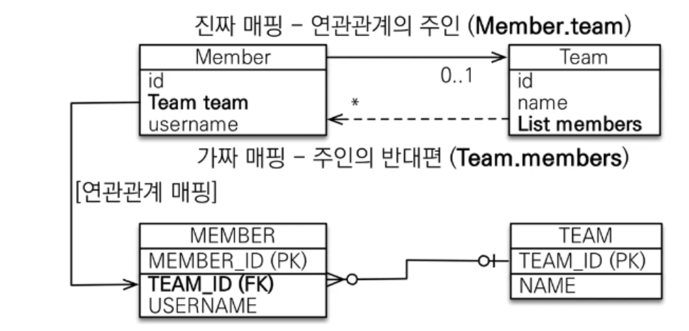
* 이렇게 사용하지 않으면 개발자가 혼란을 느낄 뿐 아니라, 성능상의 이슈가 발생할 가능성이 있다.


<br/>

📌 양방향 매핑시 가장 많이 하는 실수
-
```java
// 팀 저장
TTeam team = new TTeam();
team.setId(2L);
team.setName("team");
entityManager.persist(team);

// 멤버 저장
TMember member = new TMember();
member.setId(1L);
member.setTeam(team);
member.setUsername("유저");
entityManager.persist(member);

// 아래 코드가 필요하다. => 이미 엔티티 관리 대상이고 team을 DB에서 가져오지 않기 때문에 team에 member가 빠져 있을 수 있다. 
// team.getMembers().add(member);
```
* member를 team에 저장시켰다면, team에 꼭 member를 add 시켜준다.


<br/>

📌 양방향 매핑시 주의할 사항
-
* 영속성 관리 상태를 고려해서 항상 양쪽에 값을 설정하자.
* 연관관계 편의 메소드를 사용하자. (후술)
* 양방향 매핑시에는 무한루프를 조심
    * toString, lombok, JSON 생성 라이브러리
    * 무한 루프 방지를 위해서, Response 할 때는 별도의 DTO를 사용하기를 권장

> 연관관계 편의 메소드
* 연관관계에 있는 객체를 set 할때는 대상 객체에도 자기 자신을 set 해주는 것
```java
// Member에 team.getMembers().add(this); 추가
public TMember changeTeam(TTeam team) {
    this.team = team;
    team.getMembers().add(this);
    return this;
}
```
* 그리고 이것을 단순 setter 가 아닌, 연관관계 메소드라는 사실을 알리기 위해서 change 라는 수식어를 사용하는 것을 권장

> toString 무한루프 예시

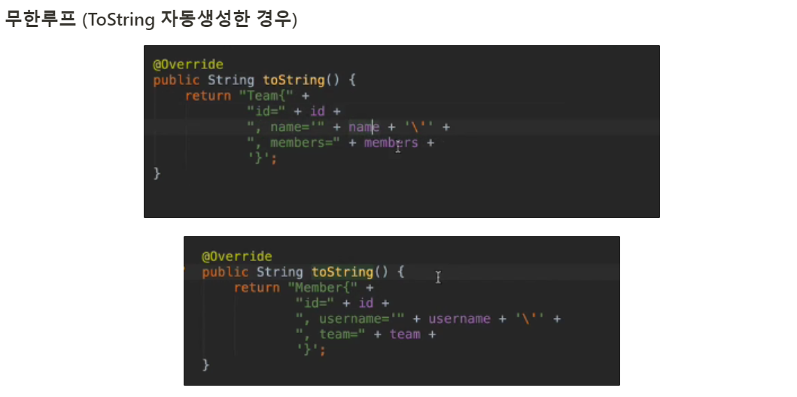
* team 에서는 member의 tostring 을 member에서는 team의 tostring 을 호출하기 때문에 무한루프에 걸릴 수 있다.

> 정리
* lombok의 toString 은 되도록 사용하지 않는다.
* Controller에서 Entity는 반환하지 않는다.
    * Entity를 반환하는 것은 나중에 변경이 있을 때 api 클라이언트 입장에서도 매우 곤란하게 만드는 것이다. DTO를 사용하면 DTO만 변하지 않게 관리를 해주면 되기 때문


<br/>

📌 양방향 매핑 정리
-
* 단방향 매핑으로도 설계 자체는 끝나야 함
* 즉, 역방향 조회가 없어도 기능 자체는 돌아 가야하는 것이고 추후 개발할 때 조회 기능이 있다면 편할 것이라고 예상될 때 추가하는 것이다.
* 사실, 역방향 탐색 기능은 보통 JPQL을 사용해서 많이 해결 합니다.


<br/>

📌 이전 설계 사항 변경
-
* 객체가 "값"을 가지고 있는 것이 아니라, "참조"를 하도록 설계 변경 
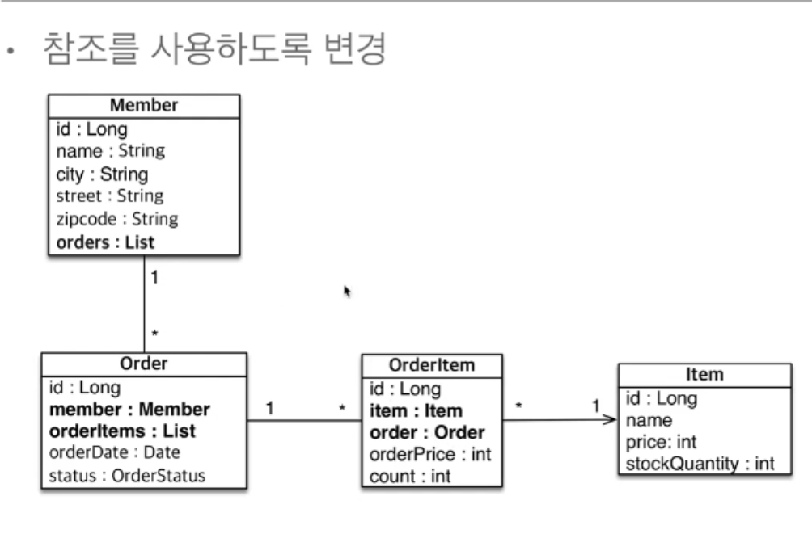
* 여기서 주의깊게 볼점은, Member에서 Order 방향으로 매핑을 하는 것은 좋은 설계가 아니다.
* 일단, Member에서 Order를 조회할 일이 기능적으로 별로 없기 때문이고 Member를 조회할 때 Order를 같이 가져오는 것은 성능상의 문제가 있을 수 있다.
* 나중에 주문내역을 조회하는 기능을 개발할 때는 Member의 pk 값을 Order로 가지고 가서 조회를 하면 될 일이지 매핑을 해서 해결할 문제가 아니다. 
* 이는 설계상 관심사를 적절하게 끊어내지 못한 것이다. => 복잡성만 증가
* 한편 Order 입장에서 어떤 상품을 주문 했는지 알기 위해서 주문 상품 리스트를 자주 확인할 것이므로, orderItems를 추가하는 것은 옳은 설계이다.
* 연관관계 매핑을 양방향으로 맺지 않아도 어플리케이션을 돌리는데에 전혀 문제가 없다.


<br/>


📌 다중성
-
* 다대일 : @ManyToOne
* 일대다 : @OneToMany
* 일대일 : @OneToOne
* 다대다 : @ManyToMany (이는 실무에선 사용하지 말아야 할 매핑)

> 매핑시 고려
* 반대방향 입장을 생각해보면 연관관계를 쉽게 설정할 수 있다.
    * 예를 들어서 주문과 회원의 관계
        * 하나의 주문을 여러 회원이 가져갈 수 있나? => 다대일?
        * 회원은 여러개의 주문을 할 수 있다. : 일대다 (따라서 반대는 다대일이 맞음)
* 한편 다대다 관계는 맺을 수는 있으나 사용해선 안되고 실무에서는 다대다 관계 사이에 별도의 테이블을 하나 만들어서 일대다 + 다대일 관계로 풀어냅니다.

> 일대다
* 기본적으로 일대다 관계에서는 다가 연관관계의 주인이나, 여기서는 다를 연관관계의 주인으로 보는 경우를 생각해보겠습니다.
* 권장하지는 않으나, 표준 스펙으로 지원하는 관계이므로 알아봅니다

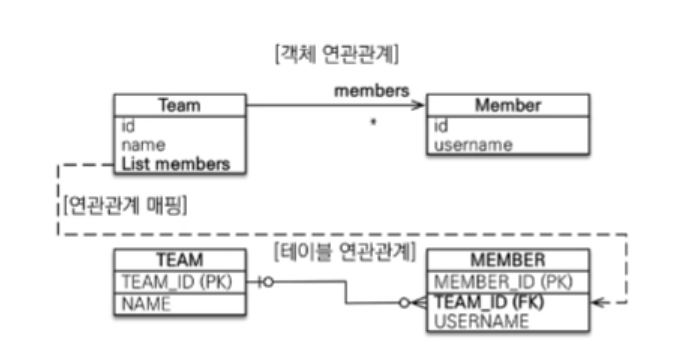
* 이는 일대다 관계 중 일인, 팀을 중심으로 무언가 해보겠다는 의도로 작성된 관계이다.
* 물론, 이것은 매핑에 대한 설계이지, DB 설계에서는 "다"에 해당하는 Member에서 FK를 관리한다. 
* 해야 할 일은 그저 Team 쪽에 @JoinColumn 으로 조인 컬럼을 명시해주고 Member 쪽에서 mappedBy(선택) 속성을 사용 해주면 됩니다.
* 이 때, team과 member 인스턴스를 생성해서 각각 persist 한다면, member를 먼저 persist 할 것이기에 team까지 insert 한 뒤, member를 update 하는 방향으로 흘러 갈 것이다(team이 member 연관관계의 주인이기 때문에).
* 그런데 더 큰 문제는 team을 수정했는데 member에 update 쿼리가 나간다는 점이다. 이는 개발자에게 큰 혼란을 줄 수 있다.
* 따라서 연관관계의 주인은 기본적으로 "다" 쪽에 두도록 하자
* 일대다 양방향을 위해서는 반대 방향의 컬럼에 insertable, updatable 을 사용해서 읽기 전용으로 만들어버리는 방법이 있으나 이는 절대 사용하지 말아야 할 것(공식 지원도 아님)


> 일대다 또다른 문제점
* 일대다의 경우 @JoinColumn 을 사용하지 않을 경우 기본 전략이 조인 테이블이기 때문에, Member와 매핑을 위한 별도의 테이블을 만들어 버릴 것임


> 일대일
* 일대일 매핑이기 때문에 유니크 제약조건(중복허용 X)을 거는 것이 권장임
* 주 테이블에 넣는 것이 개발자 입장에서 권장 사항이다.
    * 예를 들어 멤버와 라커가 있고 하나의 멤버는 하나의 라커만 가질 수 있다고 하면, 멤버가 주 테이블(많이 사용하는 테이블)이므로 멤버쪽에 FK를 넣는 것이 권장
    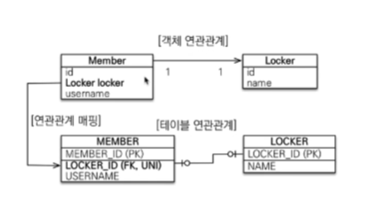
    * 연관관계의 주인은 member가 될 것이다.
    * 양방향 바인딩을 원하는 경우엔 Locker에 mappedBy 속성을 추가해서 member를 읽기 전용으로 만들어준다.
    * 바인딩을 거는 쪽에서 @JoinColumn이 필요하다.
    
> 일대일 매핑 고찰
* 비지니스 로직이 변경되어 한명의 멤버가 여러 라커를 가질 수 있다고 가정한다.
* 그러면, 라커쪽에서 member의 fk를 가지고 있는 것이 유지보수 측면에서 편하다. 라커쪽 fk에 유니크 제약조건만 풀어버리면 되는 문제이기 때문이다. 그런데 member 쪽에서 fk를 관리 했다면, 소스 또한 변경할 부분이 많아져 유지보수 측면에서 어려움이 있다
* member 에서 fk를 관리 한다면 성능상의 이점을 가지고 갈 수 있다. 왜냐하면 member는 늘 조회 되는 (주테이블) 이기 때문인데, LAZY 로딩이 안된다면 항상 많은 데이터를 가져와야 하기 때문임

> 일대일 정리
* 주 테이블에 외래키(member)
    * 주 객체가 대상 객체의 참조를 가지는 것 처럼, 주 테이블에서 대상 테이블에 대한 외래키를 두고 찾음
    * JPA 매핑 또한 편리 
    * 장점 : 개발자 입장에서 변경할 점이 항상 member를 조회하기 때문에 locker를 조회할 때 간편함 
        * 주 테이블만 조회해도 대상 테이블 데이터가 있는지 없는지 확인 가능 (null 여부)
    * 단점 : 값이 없으면 외래키 null을 허용 => DBA가 싫어함 
    
* 대상 테이블에 외래키(locker)
    * 대상 테이블에 외래키를 두고 관리
    * 장점 : 다대일 관계로 (대상이 다) 변경할 때 편리
    * 단점 : 프록시 기능의 한계 때문에 지연로딩으로 설정을 해도 항상 즉시 로딩이 되기 때문
        * 주 테이블에 외래키가 있는 경우 JPA가 대상 테이블의 연관 데이터 존재 여부를 알려면 NULL CHECK 만 하면 그만이지만,
        * 대상 테이블에 외래키가 있는 경우, 주 테이블이 연관 데이터의 존재 여부를 알아내려면 대상 테이블도 별도로 조회를 해야하기 때문이다.
        * 그럼 왜 값의 존재 여부를 알아야 하느냐? => 레이어에 대한 신뢰 때문이다. 값이 없는 이유가 단순히 데이터가 없어서라면 문제가 되지 않지만, 데이터가 있는 경우에도 연관 데이터가 NULL 로 되어 있으면 이는 신뢰성이 떨어지는 일이기 때문

> 다대다
* 관계형 데이터 베이스에서는 정규화된 테이블 2개로 다대다 관계를 표현할 수 없음 (하나의 외래키 필드에 여러 키값이 들어가는 것이 불가능 하기 때문에)
* 따라서 매핑 테이블(연결테이블, 조인테이블) 을 추가해서 일대다 + 다대일 관계로 풀어 내야함
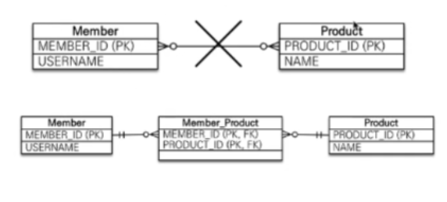
* 그러나 매핑에선 다대다 관계를 지원합니다. 허나, 이는 사용하지 않는 것이 좋습니다.
* 차라리 별도의 엔티티 객체를 만들어서 관계를 풀어내는 것이 옳음
* 위 그림을 보면 알겠지만, 다대다 관계에서는 중간 테이블에 fk를 pk로 사용하는 테이블 하나가 생성 됩니다. 그러나 저렇게 외래키를 주키로 사용하는 것보다 별도의 주키를 만들어주는 것이 좋습니다.
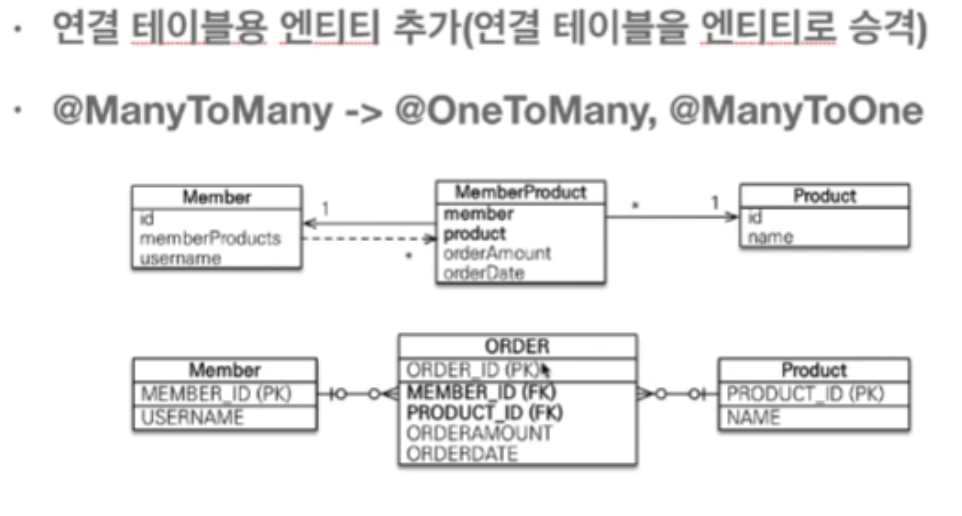
* 그래야 변화에 유연하게 대응할 수 있습니다.


<br/>

📌 실전예제
-
실전예제 확인하기
> 관계도

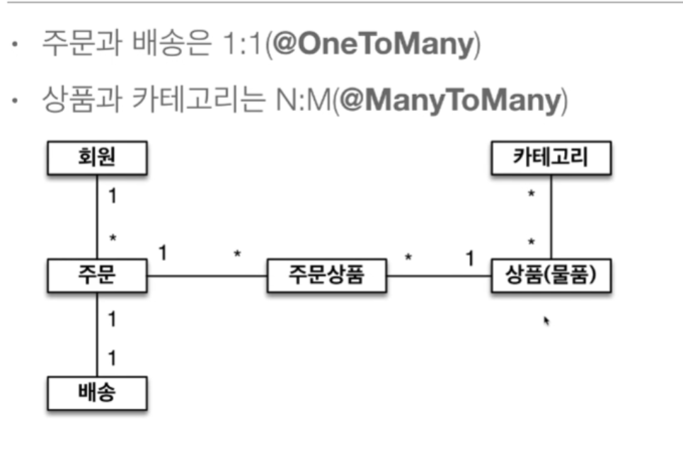

> ERD (Entity Relationship Diagram). 엔티티 모델링

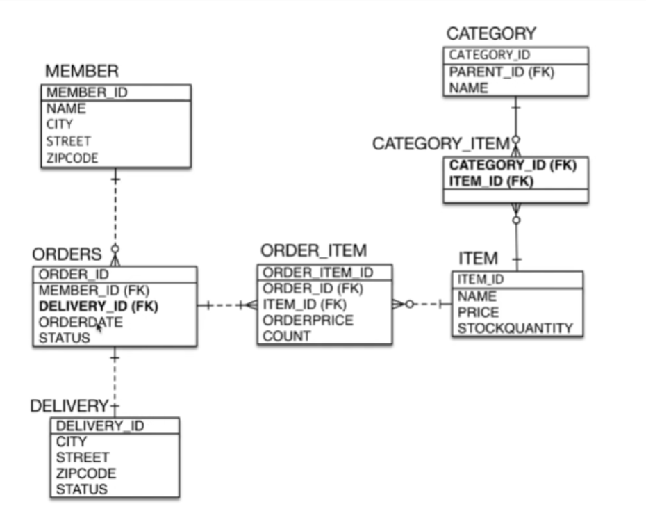
* 여기서 아이템과 카테고리의 관계가 다대다이다.
    * 하나의 아이템은 여러 카테고리에 포함 될 수 있고
    * 하나의 카테고리에는 여러 아이템이 포함 될 수 있다.

> 엔티티 관계도 상세

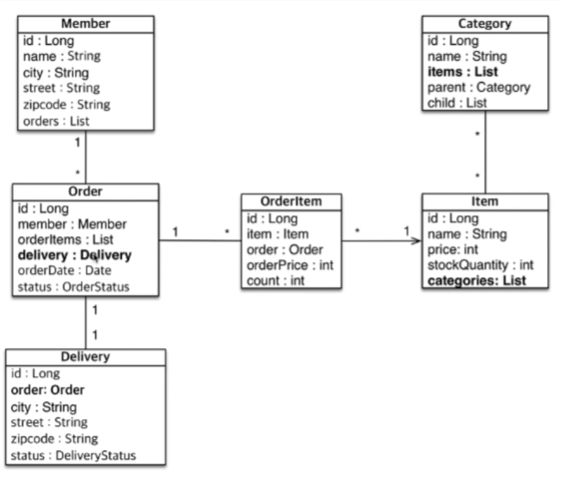

> Category
* 카테코리 부분이 살짝 어려울 수 있는데
```java
@ManyToOne
@JoinColumn(name = "QCATEGORY_ID")
private QCategory parentCategory;

// 카테고리는 하나의 부모 카테고리를 가질 수 있음. ManyToOne
@OneToMany(mappedBy = "parentCategory")
private List<QCategory> childCategories;

// 카테고리는 자식 카테고리를 가질 수 있음. 이때 자식의 수는 여러개 OneToMany
@OneToMany(mappedBy = "category")
private List<QCategoryItem> qCategoryItems;
```

* 다대다 태그를 사용해서 나타내면 
    * Category
    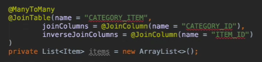
        * joinColumns 는 중간 조인 테이블의 어떤 컬럼과 조인할 것인지,
        * inverseJoinColumns 는 item 입장에서 조인테이블의 어떤 컬럼과 조인할 것인지
    * Item
    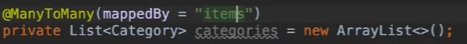


<br/>
    
📌 @JoinColumn 정리
-
* name : 매핑할 외래키 이름
* referenceColumnName : 외래키가 참조하는 대상 테이블의 컬럼명
* foreignKey : 외래키 제약 조건을 직접 지정할 수 있음. 테이블 생성시에만 사용 가능
* unique, nullable, insertable, updatable, columnDefinition, table : @Column 과 동일


<br/>

📌 @ManyToOne 정리
-
* optional : false 인 경우 연관된 엔티티가 늘 있어야 한다. (기본 true)
* fetch : 글로벌 패치 전략 (기본 EAGER, @OneToMany 에서는 LAZY)
* cascade : 영속성 전이 기능 사용
* targetEntity : 예전에 제네릭이 없을 때 사용하던 것


<br/>

📌 @OneToMany 정리
-
* mappedBy : 연관관계 주인 필드 지정
* fetch : 글로벌 패치 전략을 설정
* cascade : 영속성 전이 기능 사용
* targetEntity : 위와 마찬가지로 거의 사용 X
