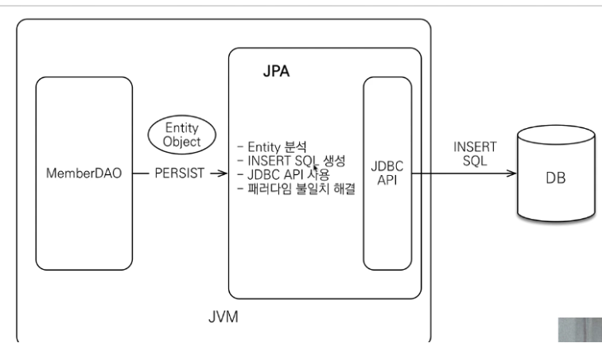

<orm 시작하기>
-


📌 기존 jdbc 프로그래밍의 문제점
-
* [OrderDAO.java](./OrderDAO.java) 
* 하나의 쿼리 작성을 위해서 많은 양의 코드를 관리 하여야 했음
* 그러다가 JDBC Template 과 같은 프레임워크가 등장하면서 

<br/>

📌 JDBC Template 과 Mybatis의 등장
-
* 하면서 코드량이 줄어들기는 하였으나, 여전히 sql 만큼은 개발자가 모두 수작업 해주어야 한다는 단점이 있었음


<br/>


📌 JPA
-

* JPA가 나와 단순하게 객체를 수정함으로써, DB와 통신이 가능해짐
* 그러나, 실무에서 수십개나 되는 테이블을 매핑하는 것 자체가 쉽지 않음 

<br/>

📌 jdbc 프로그래밍 문제점 예제
-

* 객체 CRUD를 하는데, 요구 사항이 조금만 바뀌어도 일일이 수정을 해주어야 하기 때문에 실수가 잦음


<br/>


📌 객체지향 스러운 모델링
-

* Member 에서 Team을 가져오고, insert 할 때는 Member 에 setTeam 을 한 뒤에 Member insert 하면 끝


<br/>

📌 위 모델링의 문제점
-
* 객체지향에서 모델링은, 객체간 이동이 참조를 통해서 자유롭게 할 수 있어야 한다.
* 그러나 실제로는 select 한 범위까지만 데이터가 있을 것이기 때문에, 이 모델링에 대한 신뢰문제가 발생한다.


* 어떤 데이터까지 가져왔는가를 확인하기 위해서는 find 에서 날린 쿼리를 일일이 확인 하여야 한다.
* 그렇다고 신뢰 문제를 위해 모든 객체에 대한 데이터를 모두 로딩해놓는 것은 매우 비효율적
* 위와 같은 문제점을 해결해줄 대안으로 나온 것이 JPA 이다.


<br/>


📌 JPA란?
-
* Java Persistence API 의 줄임말
* 자바 진영의 ORM 기술 표준


<br/>

📌 ORM 이란?
-
* Object-relational mapping (객체 관계 매핑)
* 즉, DB는 DB 대로, 객체지향 언어는 언어대로 프로그래밍 하고 그 사이의 간극을 메꿔주는 기술


<br/>
 
📌 JPA 의 동작
-


<br/>


📌 JPA 의 저장
-



<br/>

📌 JPA 특징
-

* 연관관계 저장
```java
member.setTeam(team);
jpa.persist(member);
```
member 에 setTeam 을 하고 저장했는데, team 데이터 또한 잘 저장 됩니다.

* 연관관계 탐색
```java
Member member = jpa.find(Member.class, memberId);
Team team = member.getTeam();
```
member 를 조회했고 거기서 getTeam 만 하면 team 데이터 또한 탐색할 수 있습니다.

* 비교
```java
String memberId = "100";
Member member1 = jpa.find(Member.class, memberId);
Member member2 = jpa.find(Member.class, memberId);

if (member1 == member2)
    System.out.println("member1과 member2가 같습니다."); // => 출력
```
같은 트랜젝션에서 조회를 했다면, id가 같을 때 같은 객체 주소를 가지도록 보장합니다. 그래서 는(=) 비교가 가능합니다.  


📌 성능 최적화   
-
JPA 는 다음과 같은 성능 최적화 기법을 제공합니다.
    * 1차 캐시와 동일성 (identify) 보장
    * 트랜젝션을 지원하는 쓰기 지연 (transactional write-behind) => 쿼리 모아서 한번에 write
    * 지연 로딩 (Lazy Loading)

위와 같은 작동이 가능한 이유는, JPA 계층이 하나 더 존재하기 때문이다.

> 1차 캐시와 동일성 보장
* [SamenessQuarantee.java](./SamenessQuarantee.java)
* 같은 트랜젝션 안에서는 아이디가 같을 경우 늘, 같은 엔티티를 반환 - 약간의 조회 성능 향상
* DB Isolation Level 이 Read Commit 이어도, 애플리케이션에서 Repeatable Read 를 보장한다.
    * DB Isolation Level 이란? 
        * 트랜젝션의 격리 수준이란, 동시에 여러 트랜젝션이 처리 될 때 트랜젝션 끼리 얼마나 고립되어 있는지를 나타내는 것이다. 즉, 특정 트랜젝션 내에서 다른 트랜젝션이 수정한 데이터를 볼 수 있도록 허용할지 말지를 결정하는 Level 이다.
        * 격리 수준은 크게 4가지로 나뉘지만, 그 중에서도 Read Commit Level은, 트랜젝션이 커밋 되기 이전까지는 다른 트랜젝션에서 Read 하는 것을 허용하지 않는 Level이다.
        * 그런데 이를 애플리케이션 계층에서 허용해주는 것이다.
```java
String memberId = "100";
Member m1 = jpa.find(Member.class, memberId); // DB에 다녀옵니다. 찾은 데이터는 캐시에 저장합니다.
Member m2 = jpa.find(Member.class, memberId); // 캐시된 데이터를 가져옵니다.

...println(m1 == m2); // true
```
* 1번만 SQL을 실행 & 동일성 보장

<br/>

> 트랜젝션을 지원하는 쓰기 지연
* [DelayWrite.java](./DelayWrite.java)
* 트랜젝션을 커밋할 때까지 INSERT SQL 을 모음
* JDBC BATCH SQL 기능을 사용해서 한번에 SQL 전송
* sql 을 날리려면 네트워크를 이용해야하는데 DB에 쿼리를 여러번 날리는 것보다, 네트워크를 한번 더 타는 비용이 크기 때문에 되도록 쿼리를 한번에 보내는 것이 성능상 유리하다.
* 비슷한 쿼리를 보낼 때 JDBC Batch 라는 기능을 이용해서 쿼리를 한번에 보낼 수 있는데 이는 사용이 복잡함. 그런데 JPA 는 이를 이용해서 우리 대신 쉽게 쓰기 지연을 해주고 있음

> 지연로딩과 즉시로딩
* [Loading.java](./Loading.java)
```java
// 지연로딩
Member member = memberDAO.find(memberId); // member select
Team team = member.getTeam();
String teamName = team.getName();   // team select

// 즉시로딩
Member member = memberDAO.find(memberId); // member and team select (with join)
Team team = member.getTeam();
String teamName = team.getName(); 
```

* Entity에서 또 다른 Entity 데이터를 가져오려고 할 때 데이터를 로딩하느냐 차이이다.
    * 즉시로딩 : @ManyToOne(fetch = FetchType.EAGER)
        * select 하는 시점에 join 으로 데이터를 로딩합니다.
    * 지연로딩 : @ManyToOne(fetch = FetchType.LAZY)
        * 데이터를 사용하는 시점에 별도로 SELECT 합니다.
    


