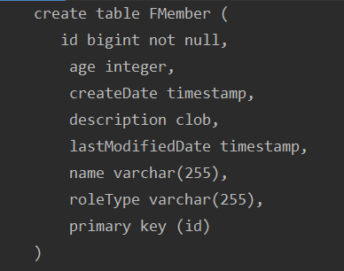
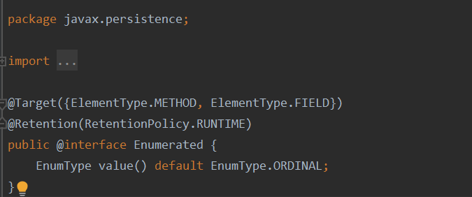
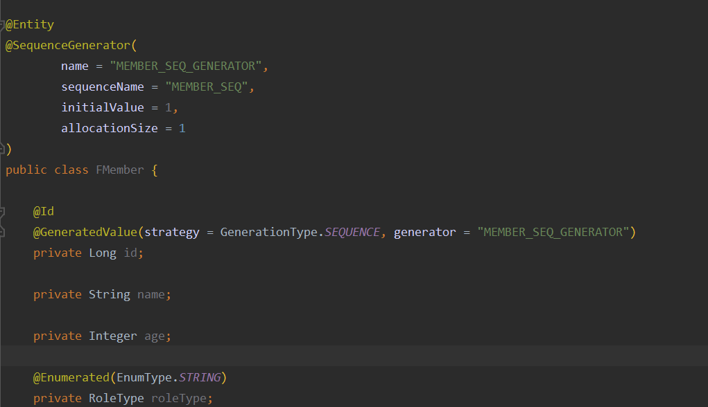
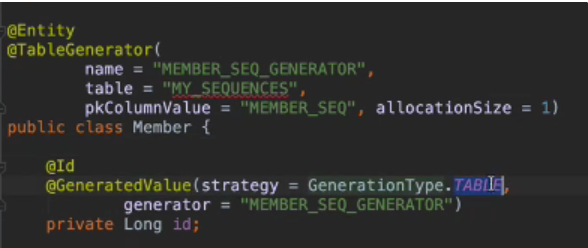
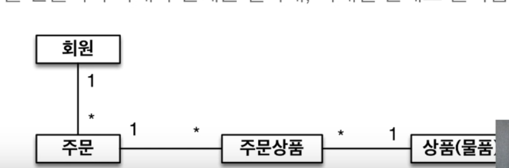
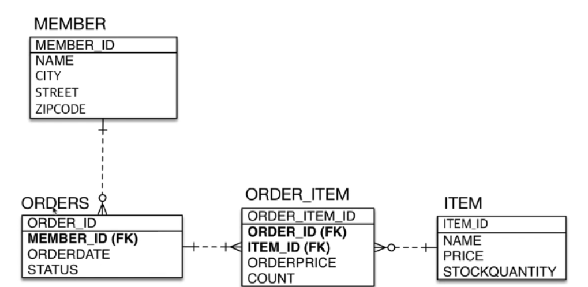
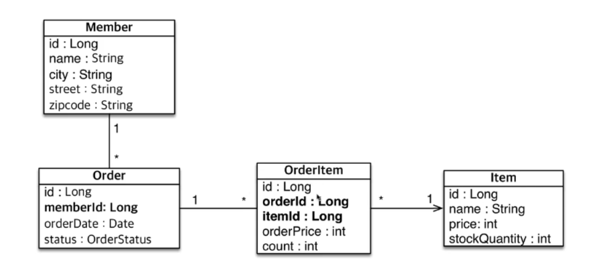
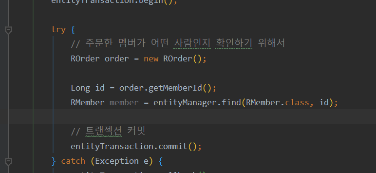

📌 매핑 어노테이션
-
* 객체와 테이블 매핑 : @Entity, @Table
* 필드와 컬럼 매핑 : @Column
* 기본 키 매핑 : @Id
* 연관관계 매핑 : @ManyToOne, @JoinColumn
    * 참조관계를 나타내기 위해 사용하는 어노테이션

<br/>

> @Entity
* @Entity 가 붙은 클래스를 JPA가 관리해준다. 
* @Entity 가 붙은 클래스를 엔티티라고 한다. 
* 주의
    * 기본 생성자 필수(public or protected)
    * final 클래스, enum, interface, inner 클래스 사용 해도 무의미
    * 저장할 필드에 final 사용 X

> @Table
* 아래와 같은 속성 존재
    * name : 매핑할 테이블 이름
    * catalog : 데이터베이스에 catalog 매핑
        * catalog 는 DB 테이블 등등의 구조 파악을 위한 정보를 담고 있는 공간
    * schema : 데이터베이스 schema 매핑
    * uniqueConstraints : DDL 생성시 유니크 제약조건 생성


> @Column
* 아래와 같은 요구 사항이 있다고 가정
    * 회원은 일반 회원과 관리자로 구분
    * 회원 가입일과 수정일이 있어야 한다.
    * 회원을 설명할 수 있는 필드가 있어야 한다. 이 필드는 길이 제한이 없다.
* [FMember.java](./FMember.java)
    * @Enumerated(EnumType.STRING) : DB에서는 enum type을 지원하지 않는 경우가 종종 있는데 그 타입과 맞추기 위해서 String으로 많이 사용함
    * @Temporal(TemporalType.TIMESTAMP) : 자바와 달리 DB는 날짜, 시간, 초 정보가 전부 각각인 경우가 많다. 이것을 매핑하기 위한 어노테이션 이다.
    * @Lob : 아주 큰 데이터를 넣을 때 사용한다.
        * CLOB : 대형 문자를 저장하는 타입 (default)
        * BLOB : 대형 객체(Binary), 이미지, 동영상, MP3 등

* 결과
    

* 정리
    * @Column : 컬럼 매핑
    * @Temporal : 날짜 타입 매핑
    * @Enumerated : enum 타입 매핑
    * @Lob : BLOB, CLOB 매핑
    * @Transient : 특정 필드를 컬럼에 매핑하지 않음 (매핑 무시)
        
    * Column 속성 정리
        * name : 필드와 매핑할 컬럼의 이름 (기본 : 필드 이름)
        * insertable, updatable : 등록, 수정 가능 여부 (기본 : false)
        * nullable(DDL) : null 값의 허용여부 설정. false 로 하면 DDL 생성시 not null 조건이 붙음
        * unique(DDL) : @Table의 uniqueConstraints와 같으나, 한 컬럼에만 간단하게 제약조건을 걸때 사용함
            * 다만, 실 운영에서는 사용하지 않는데, 키의 이름이 자동생성 값이기 때문에 디버깅시 어려움이 따르기 때문이다.
        * columnDefinition(DDL) : 데이터베이스에 컬럼 정보를 직접 줄 수 있음 (예 : varchar(100) default 'EMPTY' => 방언을 사용해야함)
        * length(DDL) : 오직 String 타입에만 사용. 길이제한 (기본 : 255)
        * precision, scale(DDL) : BigDecimal, BigInteger 타입에 사용. precision은 소수점 포함한 전체 자리수이고, scale은 소수점 자리수이다. double랑 float타입에는 적용 되지 않는다.
    
    * @Enumerated 주의사항
        * Enumerated 어노테이션은 기본값이 ORDINAL 인데, 이는 숫자 타입이다. ENUM의 경우 필드의 인스턴스의 순서에 따라서 이 숫자값(1, 2, 3)이 달라지는데 이 점이 운영서버에서 큰 문제를 일으킬 수 있기 때문에, @Enumerated 는 꼭 STRING 타입으로 사용하도록 한다.
    
    
    * @Temporal 특징
        * 하이버네이트 최신 버전은 굳이 어노테이션을 사용하지 않아도 자동으로 맞춰서 생성해준다.    

* @Lob 특징
    * 객체의 타입이 String 또는 char[] 인 경우 CLOB, byte[] 인 경우 BLOB이 만들어진다.


> @Id
* ID 필드의 타입은 되도록 Long 타입을 쓰는 것을 권장합니다.
* 기본키를 직접 매핑하려는 경우에는 이 어노테이션만 사용 합니다. 그러나 보통은 DB가 생성해주는 값을 사용하는 것이 보통
    * @GeneratedValue : id를 어떤 것으로 쓸지에 대한 전략. 아래와 같이 4가지 속성을 받을 수 있음 (@GeneratedValue(strategy = GenerationType.xxxxxx))
        * IDENTITY : 데이터베이스에 위임. MYSQL 의 경우 AUTO_INCREASE
        * SEQUENCE : 데이터 베이스의 시퀀스 오브젝트 사용, Oracle에서 사용
            * @SequenceGenerator 어노테이션으로 시퀀스 객체에 대한 정보를 넘겨야 한다.
        * TABLE : 키 생성용 테이블 사용. 모든 DB에서 사용 => @TableGenerator 필요
            * 시퀀스용 별도의 테이블을 만드는 것이라서 성능은 그닥 좋지 않음
        * AUTO : 방언에 따라 자동 지정. 기본 값
        
    * IDENTITY 전략 특징
        * 기본키 생성을 DB에 위임 
        * insert 될 때 값이 null 로 들어가야함. 그러면 DB가 알아서 그 값을 채워 넣어줌 => 키값을 미리 받아놓고 쓸 수 없음 (DB에 insert 되는 시점에 결정되기 때문)
        * 영속성 컨텍스트에서 영속성 관리를 위해서는 pk 값이 있어야 하기 때문에 위 전략을 쓸 경우 "트랜젝션을 지원하는 쓰기 지연" 기능은 사용할 수 없다. 바로 쿼리가 날아가서 pk 값을 받아와 영속성을 관리하기 때문이다.
        * 하나의 엔티티 persist 를 하기 위해 1번만 네트워킹을 타면 됨
        
    * SEQUENCE 전략 특징
        * 데이터베이스의 시퀀스 오브젝트 사용
        * 아래 그림 처럼 @SequenceGenerator의 name 값과 @GeneratedValue의 generator 값을 맞춰주어야 한다.
        
        * @SequenceGenerator는 성능 개선의 여지가 있습니다. 이는 후술
            * allocationSize 값을 조절해서 성능 조절 가능
        * [FMember.java](./FMember.java)
        * 먼저 DB의 시퀀스를 호출해서 시퀀스 값을 받아오고 그것을 토대로 insert 쿼리를 작성하기 때문에 persist 를 위해 기본 네트워킹을 2번 탄다는 것이 특징. 또한 아이디 값을 먼저 받아오기 때문에 insert 시점에 이미 영속성 관리가 가능해진다.
        
    * TABLE 전략 특징
        * 키 생성 전용 테이블을 하나 만들어 시퀀스를 흉내내는 것 
        * 모든 DB에 적용 가능하다는 것은 장점이나, 성능이 단점임
        
        * table 이름을 명시해주어야 합니다. MY_SEQUENCE 라는 테이블이 생성 되고 거기 내부에 시퀀스 값이 들어 갑니다.
    
    * 키 생성 전략 
        * 기본키 제약 조건 : null 이 아니어야 하고 유일하며, 변하지 않는 값이어야 함. 또한 비지니스 로직이 들어가선 안됨
        * 미래까지 위 조건을 만족하는 자연키 (비지니스 로직이 들어간 키. 예를 들면 주민번호, 이메일)는 찾기 어렵다. 따라서 대체키(대리키)를 사용한다.
        * ( Long type + 대체키 + 키생성전략 ) 사용을 권장    
        * 자연키는 나중에 쓰지 못하게 되거나 그럴 일이 잦음(정책 변경으로)


<br/>
    
        

📌 아이디 생성전략. SEQUENCE 성능 개선
-
* SEQUENCE 생성 전략은 먼저 키값을 받아오고 그 키값을 세팅해서 DB에 INSERT 하는 방법이다. 
* 따라서 네트워크를 2번 타야하기 때문에 성능 저하가 일어날 수 있는데 이 문제를 해결할 수 있는 방법이 allocationSize 값을 조절하는 방법이다.
* 다만 사용할 때 주의할 점은 allocationSize 는 실제 DB의 시퀀스 자동증가 값보다 작아야 합니다. (같이 맞추어 주는 것이 베스트)
* 왜냐하면 작동 방식이 아래와 같이 때문입니다.
    1. JPA 가 DB에 시퀀스를 2번 연속 호출(최초호출)해서 자동 증가 값을 올려 놓습니다.
        * 예를 들어서 DB의 자동 증가 값이 50이고 현재 시퀀스의 값이 1이라고 가정을 하면 2번 호출 했을 때 값이 51이 됩니다. 그러면 1부터 51 사이의 pk 값은 다른 WAS 서버가 사용할 수 없는 값이 됩니다. (동시성 문제 해결)
    2. 이 후 persist가 호출되도 DB에 시퀀스 값을 받으러 가지 않고 메모리에서 시퀀스 값을 찾습니다. 1부터 51번이 호출될 때까지는 다시 DB의 시퀀스를 호출하지 않습니다.
    3. 51 번을 호출한 뒤에는 다시 한번 시퀀스를 호출하는데, 이 때 다시 51 + 50 인 101번을 받아옵니다.
    4. 끝값 - (allocationSize - 1) 공식을 사용해서 시작값을 52로 정하고 101번이 사용될때까지 DB의 시퀀스는 호출하지 않습니다.
* 예를 들어서 현재 시퀀스가 51에 있고 자동증가 값이 20 인데, allocationSize가 50으로 자동증가 값보다 더 클 경우,  1번 시퀀스를 호출해서 받아온 값은 71이 되기 때문에 시작값은 71 - (50 - 1) = 22 부터 시작한다. 그런데 22번은 11 ~ 31 사이에 있는 값으로 다른 WAS에서 사용할 수 있는 값이기 때문에 충돌이 날 수 있는 것이다.
* 따라서 allocationSize 는 늘 시퀀스의 자동증가 값과 동일하게 해주어야 한다. 
* allocationSize 가 너무 커지는 것은 낭비 가능성이 조금 있어서 적절하게 50 ~ 100 사이 값으로 해주면 될 것 같다.

<br/>

📌 실전 예제
-
실전예제 패키지 참고 

> 요구사항
* 회원은 상품을 주문할 수 있다. 
* 주문시 여러종류의 상품을 선택할 수 있다.

> 기능
* 회원 기능
    * 회원 등록
    * 회원 조회
* 상품 기능
    * 상품 등록
    * 상품 수정
    * 상품 조회
* 주문 기능
    * 상품 주문
    * 주문 내역 취소
    * 주문 취소

> 도메인 모델 분석
* 회원과 주문의 관계 : 회원은 여러 번 주문할 수 있다. (일대다)
* 주문과 상품의 관계 : 주문할 때 여러 상품을 선택할 수 있다. 반대로 같은 상품도 여러번 주문이 될 수 있다. => 다대다 관계를 주문 상품이라는 다대다 관계를 일대다, 다대일 관계로 풀어낼 수 있다. 


> 테이블 설계



> 엔티티 설계와 매핑


* 이는 잘못된 엔티티 설계이나, 일단은 배운 대로 이렇게 진행을 하도록 한다.

> 위 설계의 문제점
* 주문으로 부터 주문인을 찾아오는 과정이 복잡하고 객체지향스럽지 않음. 우리가 원하는 것은 Order 로 부터 바로 Member를 가져오는 것이다.



<br/>


📌 데이터베이스 스키마 자동 생성
-
* DDL을 애플리케이션 실행 시점에 자동 생성하는 것
* 테이블 중심 -> 객체 중심
* 오직 개발 장비에서만 사용하여야 함 
* 운영서버에서 사용을 하려면 적절하게 다듬은 후, 사용하여야 함
* 아래 속성을 수정하여서 자동 생성 여부를 정할 수 있음
    ```xml
    <!-- 시작 시점 테이블 자동 생성 기능 -->
    <property name="hibernate.hbm2ddl.auto" value="create" />
    ```
    * create : 기존 테이블 삭제 후 다시 생성
    * create-drop : create와 같으나 종료 시점에 테이블 DROP
    * update : 변경 부분만 반영 (운영 DB에는 절대 사용하면 안됨)
        - alter 으로, 변경 분만 저장이 된다! 추가하는 것만 된다.
    * validate : 엔티티와 테이블이 정상 매핑 되었는지 확인
        - 현재 사항과 Entity 간의 차이가 없는지 확인을 한 뒤에 같으면 실행하고 같지 않으면 에러가 난다.
    * none : 사용하지 않음

* 필드의 DDL 자동생성
    * 무결성 제약 조건
    ```text
    @Column (nullable = false, length = 10)
    ```
        * 필수인지, 길이는 어느 정도인지
    * 유니크 제약조건 추가
    ```text
    @Table(uniqueConstraints = {@UniqueConstraint(name="NAME_AGE_UNIQUE", columnNames = {"NAME", "AGE"} )})
    ```
    
     

📌 자동 스키마 생성 사용법
-
* 개발 초기 : create || update
* 테스트 서버 : validate || update
* 스테이징과 운영서버 : validate || none
근본적으로 DB에 update, create 가 되지 않도록 계정을 나누는 것이 맞지만, 그래도 사용하지 않는 것이 가장 좋다. 테스트 서버에도 update 등등은 사용하지 않는것이 좋고 오직 validate만 사용하는 것이 좋다. 


