📌 JPA 타입 분류
-
* JPA 가 취급하는 타입의 종류는 크게 아래와 같이 2 종류가 있음 
    * 엔티티 타입
        * @Entity 로 정의하는 객체
        * 데이터가 변해도 지속적으로 추적가능
        * 예) 회원 엔티티의 키, 나이 값을 변경해도 식별자로 인식 가능
    * 값 타입
        * int, Integer, String 처럼 단순하게 값으로 사용하는 타입 or 객체
        * 식별자가 없고 값만 있어서 변경시 추적 불가능
        * 예) 숫자 100을 200으로 변경하면 완전히 다른 값으로 대체
        
> 값 타입의 분류
* 기본 값 타입
    * 자바 기본 값 타입 (int, double)
    * 래퍼 클래스(Integer, Long)
    * String
* 임베디드 타입 (복합 값 타입, 클래스)
* 컬렉션 값 타입


<br/>

> 기본 값 타입
* 예) String name, int age
* 생명 주기를 엔티티에 의존한다.
* 이 타입은 절대로 공유해서는 안되는 타입이다. 
    * 예를 들어서 나의 이름을 변경했는데 다른 사람의 이름이 변경되는 등등의 문제가 발생할 수 있음
    * 자바에서 Class 는 공유가 가능(래퍼런스를 통해)한 객체인데, Integer나 String 등등은 setter를 없애서 변경 자체를 불가하게 만들어 놓은 불편 객체이다.
        * 공유 문제로 발생하는 사이드 이펙트 제거

> 임베디드 타입 (복합 값 타입) (내장 타입)
-
* 새로운 값 타입을 직접 정의할 수 있음
* JPA 는 임베디드 타입이라고 함
* 주로 기본 값 타입을 모아서 만들기 때문에 복합 값 타입이라고도 함
* int, String 과 같은 타입이라서 변경하면 그대로 끝

> 임베디드 타입의 활용
* 비지니스 로직이 다음과 같다.
    * 회원 엔티티는 이름, 근무 시작일, 근무 종료일, 주소 도시, 주소 번지, 주소 우편 번호를 가진다.
    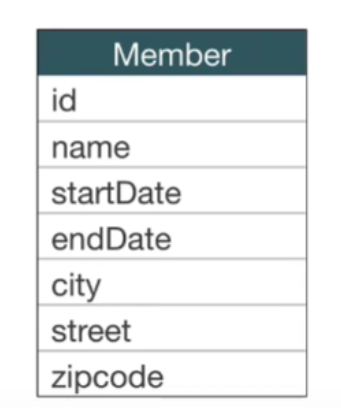
* 임베디드 타입을 이용하면 근무 시작일, 근무 종료일을 묶어 "근무 기간"이 되고 주소 도시, 번지, 우편번호를 묶어 "주소"로 추상화 된다. 
* 따라서 아래와 같이 비지니스 로직이 변경된다.
    * 회원 엔티티는 이름, 근무 기간, 주소를 가진다.
    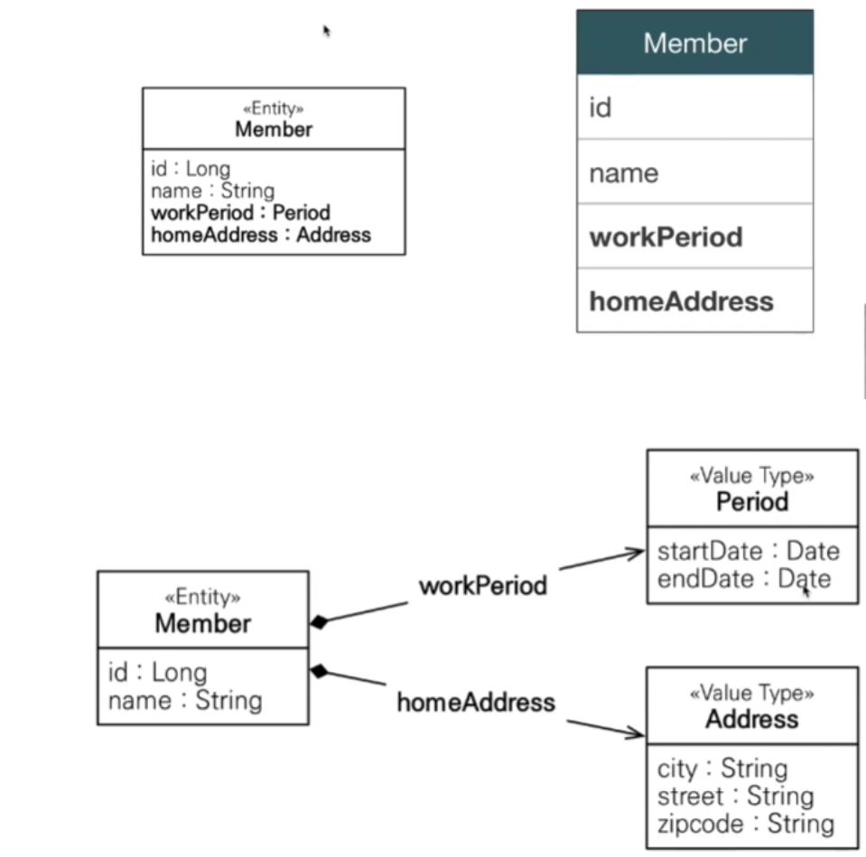
* 이렇게 함으로써 객체지향적으로 프로그래밍을 할 수 있게 됩니다.
    * [참고](./usage/Run.java)
    
    
* 다음과 같은 이점을 가져갈 수 있다.
    * 높은 응집도
    * 재사용성
    * Perios.isWork() 처럼 해당 값 타입만 사용하는 의미 있는 메소드를 만들 수 있음 ⇒ 객체지향적
    * 생명주기를 소유한 엔티티에 의존해서 별도로 관리할 필요가 없음
    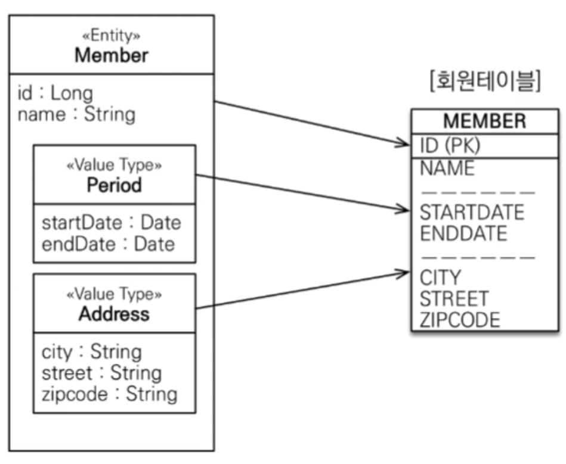
    
    
> 임베디드 타입 사용법
* 기본 생성자 필수
* @Embeddable : 값 타입을 정의하는 곳(클래스)에
* @Embedded : 값 타입을 사용하는 곳(엔티티의 필드)에
    * 위 어노테이션은 둘중 하나만 써줘도 되긴 하나 둘다 써주는 것이 좋음

> 임베디드 타입 특징
* 임베디드 타입을 사용하기 전 후 매핑하는 테이블은 같다.
* 객체와 테이블을 아주 세밀하게 매핑하는 것이 가능하다.
    * 테이블과는 별도로 객체지향 스러운 설계가 가능해짐
* 잘 설계한 ORM 애플리케이션은 매핑한 테이블의 수보다 임베디드 타입의 수가 더 많음
* 임베디드 타입은 임베디드 타입을 가질 수 있음
* 임베디드 타입은 엔티티를 필드로 가질 수 있음
    * [참고](./Address.java)
    ```java
    @OneToOne
    private Box box;
    ```
    * 연관관계 어노테이션을 추가해주면 사용이 가능하다.
* 같은 임베디드 타입이 중복 사용을 하려는 경우 @AttributeOverrides 어노테이션을 이용해서 해결이 가능하다.
    * [참고](./usage/Run.java)
    ```java
    @Embedded
    @AttributeOverrides({
            @AttributeOverride(name="startDate", column = @Column(name = "S_DATE")),
            @AttributeOverride(name="endDate", column = @Column(name = "E_DATE")),
    })
    private Period secondPeriod;
    ```
    * 컬럼명 속성을 재정의 하는 것입니다.
* 임베디드 타입이 null 로 할당이 되면 임베디드 타입 내부의 모든 필드 또한, null 값이 할당 됩니다.
* 임베디드 타입 내부의 필드는 테이블 컬럼과 매핑이 되기 때문에 당연히 @Column 이 사용 가능 합니다.
    * @Column 을 사용해서 필드의 길이 등등을 정해주어야 이것을 사용하는 다른 테이블의 필드의 속성도 통일이 가능 합니다.
    
> 임베디드 타입과 @MappedSuperclass 의 차이점
* @MappedSuperclass 는 상속을 사용하고 임베디드 타입은 별도 클래스로 묶은 것을 필드로 가져가는 것이다.
* 이외에는 DB와 객체지향 프로그래밍의 관점에서도 둘의 차이점은 없다고 할 수 있으나, JPQL을 사용할 때 조금 다릅니다.
* 예를 들어서 멤버의 생성일을 통해 조회를 한다고 가정
    * 임베디드 타입을 사용한 경우 (임베디드 타입 명시)
        * select m from Member m where m.traceDate.createdDate > ?
    * 상속을 사용하는 경우
        * select m from Member m where m.createdDate > ?
    * 상속을 사용하는 쪽이 조금 더 직관적이다.

> 임베디드 타입 불변객체
* 임베디드 타입은 공유를 통해 사이드 이펙트가 일어날 수 있기 때문에 불변 객체로 만들어 주어야 합니다.
* [사이드 이펙트 예제](./side/Run.java) 를 보면 persist 한 객체가 address 객체를 공유하고 있는데, 이때 한 멤버에서 address를 수정하니까 다른 멤버에게도 update 쿼리가 나갔다.
    ```text
    Hibernate: 
        /* update
            Nine.XMember */ update
                XMember 
            set
                address=?,
                box_id=?,
                city=?,
                zipCode=?,
                name=?,
                endDate=?,
                startDate=?,
                E_DATE=?,
                S_DATE=? 
            where
                id=?
    Hibernate: 
        /* update
            Nine.XMember */ update
                XMember 
            set
                address=?,
                box_id=?,
                city=?,
                zipCode=?,
                name=?,
                endDate=?,
                startDate=?,
                E_DATE=?,
                S_DATE=? 
            where
                id=?
    ```
* 따라서 임베디드 객체는 setter 를 제거하고 늘 new 를 통해서만 생성할 수 있도록 불변객체로 만들어야 한다.
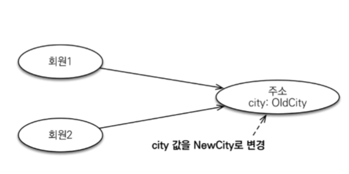
* 위 처럼 불변객체로 만든 경우 값타입을 공유해도 문제가 없지만 되도록이면 값을 복사(new)해서 사용 하는 것이 좋음
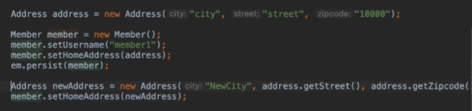
* 자바의 Integer, String은 대표적인 불변객체이다.


> 값 타입의 비교
* 엔티티의 경우 JPA가 PK 값에 따라 비교를 해주기 때문에 그냥 사용해도 문제가 없지만 값 타입은 우리가 직접 비교를 하는 것으로 기본은 참조값 비교이다.
* 한편, 같은 데이터를 가진 값타입은 같은 객체로 취급해야하기 때문에 우리는 별도로 equals 를 재정의 해야한다.
    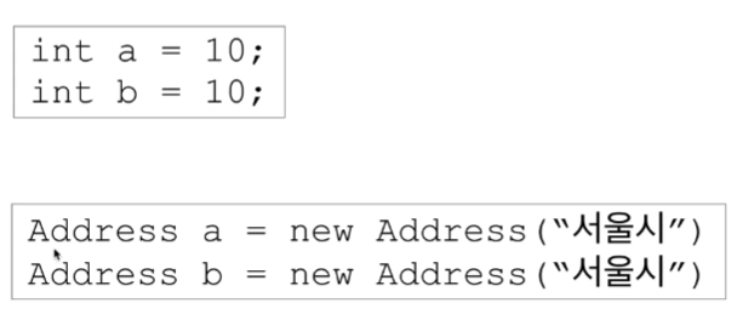
    * 동일성 비교 : 인스턴스의 참조값 비교 (==)
    * 동등성 비교 : 인스턴스의 값을 비교
    * 동일성이 아니라, 동등성 비교를 해야함
    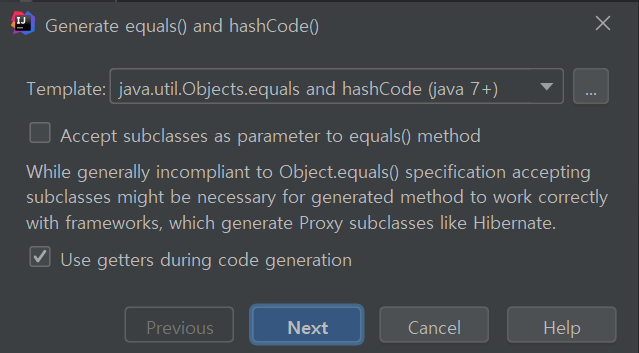
    * 이 때 getter를 사용하는 것에 check (프록시 객체의 경우에도 비교할 수 있도록)

> 값 타입 컬렉션

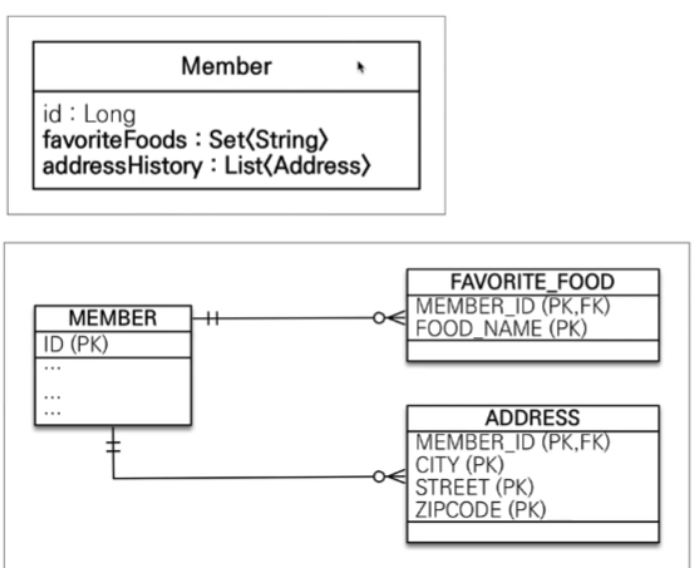
* 값타입이 컬렉션인 경우 별도의 테이블로 만들어서 값 타입을 관리합니다. (이때 PK 는 없습니다)
* 이는 @ManyToOne을 사용하는 엔티티가 하나 늘어남을 의미하고 결국엔 엔티티로 취급합니다.

> 값 타입 컬렉션 사용
* @ElementCollection 으로 선언 한 뒤, @CollectionTable 을 통해서 테이블과 매핑을 해주고, JoinColumn 을 통해서 어떤 필드가 FK 인지 알려주어야 합니다.  (연관관계의 주인이 일대다 중 "다" 쪽인점 주의)
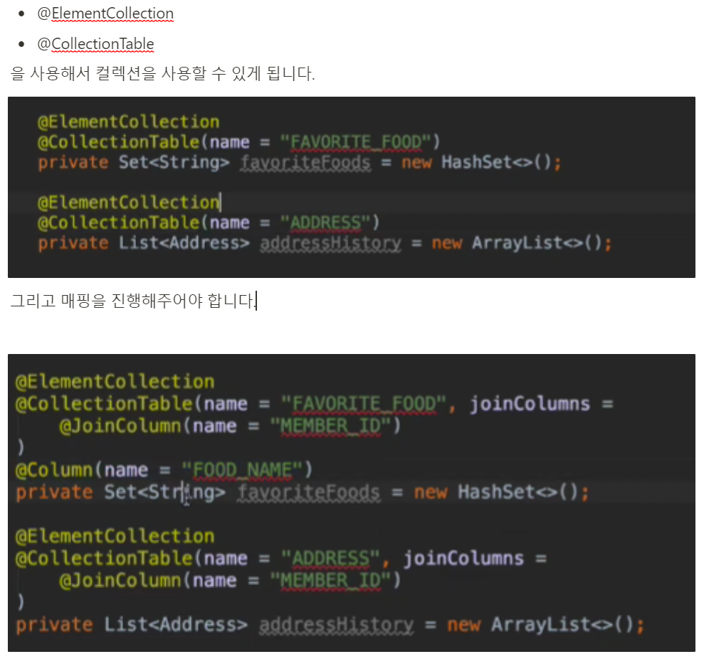
* 내부에 사용자 정의 값 타입인 address는 joinColumn 정도만 추가해주면 되고
* favoriteFoods 는 String 타입의 값 타입으로, 매핑할 컬럼 이름이 확실하지 않으므로 직접 정의해주면됩니다.
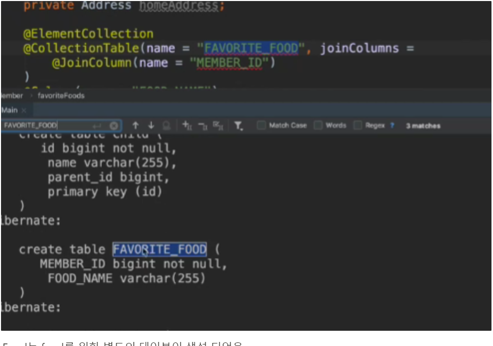
* 엔티티를 사용하는 것과 다른 점은, 생명주기가 완전히 부모와 동일하게 된다는 점 (영속성 전이 + 고아 객체 기능)
* 테이블에 값 타입 컬렉션의 데이터가 잘 들어간 모습
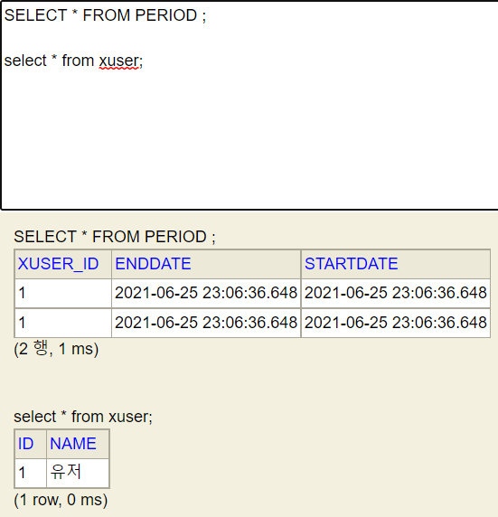
* [예제 참고](./collection/Run.java)


> 값 타입 컬렉션 저장 예제

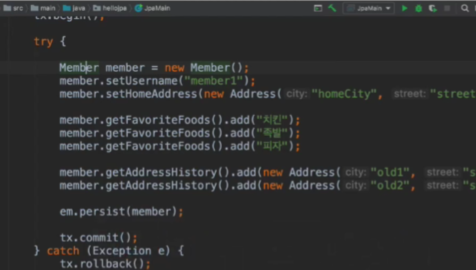

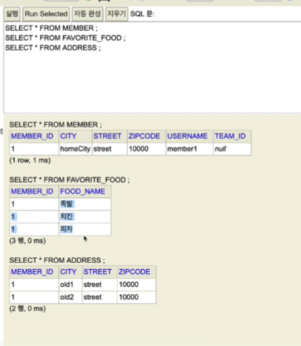
* 값이 잘 저장 되고 있음

> 값 타입 컬렉션 조회 예제

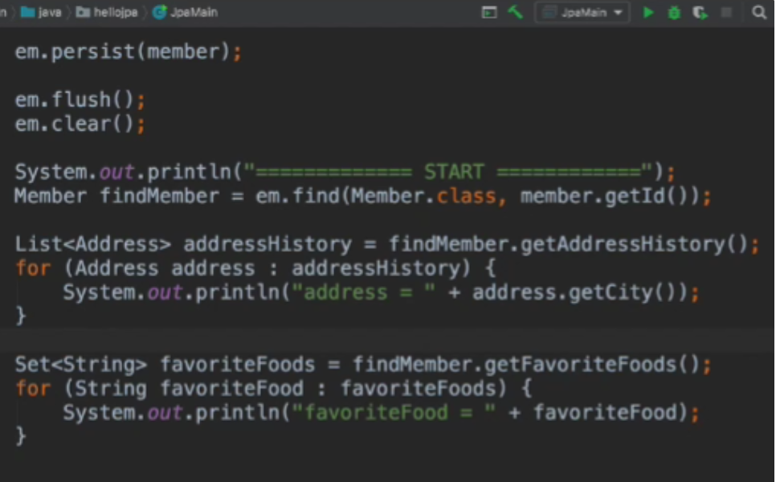
* 지연로딩이 기본적으로 적용 된다. 이는 @ElementCollection 어노테이션에 fetch type이 LAZY 이기 때문이다.


> 값 타입 컬렉션 수정 예제

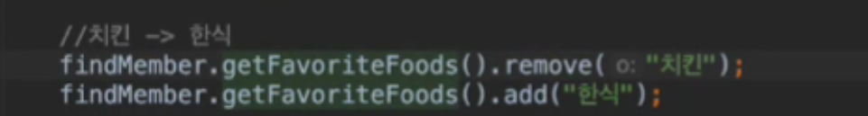
* 임베디드 값 타입을 update 하려고 하면 불변 객체이기 때문에, 그냥 값을 지우고 다시 넣어야 함
* 이때 만약 임베디드 값 타입이라면, remove 할 객체를 찾는 매커니즘은 equals 를 사용하기 때문에 equals 를 제대로 구현해주어야 함
* 그런데 이 때 문제는, 임베디드 값 타입과 매핑된 테이블에는 PK 개념이 없기 때문에 어떤 데이터가 수정되었는지 알 방법이 없다.
* 따라서, FK 에 해당하는 값을 모두 지운 뒤에, 다시 add 하는 것이다. 
* update 쿼리를 날리는 방법은 @OrderColumn 같은 것은 어렵게 해결할 수는 있지만, 이런 것도 위험성이 있어서 어렵다.
* 따라서, 값 타입 컬렉션은 사용하지 않는다.

> 값 타입 컬렉션 대안
* 실무에서는 상황에 따라, 값 타입 컬렉션 대신에 일대다 관계를 고려
* 일대다 관계 엔티티를 만든 뒤에 여기에 값 타입을 사용하는 방법으로 해결
* 이렇게 만든 엔티티에는 영속성 전이 + 고아객체 속성을 모두 추가해줌
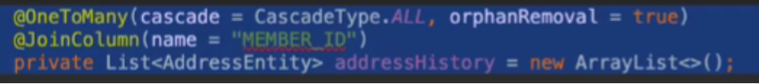

> 값 타입 컬렉션을 사용해도 될 때
* 값을 추적할 필요도 없고 값이 바뀌었을 때 싹다 지우고 다시 넣어도 무관한 객체 (크기도 별로 크지 않은게 좋을 듯)
* 예를 들어서 자신이 선호하는 운동 리스트를 선택할 때 (이 데이터는 완전히 자신이라는 객체에 포함됨)

> 이력은, 값 타입 컬렉션이 아니라 엔티티이다.
* 예를 들어 보드 수정이력을 남긴다고 할 때 보드가 삭제 되어도 수정이력은 남아야 하기 때문에 이는 엔티티이다.
* 또한, 보드에서만 이력을 볼게 아니라, 멤버에서 시작되어서 보드 이력을 보게될 경우도 있기 때문에 이는 엔티티로 만들어야 한다.

> 엔티티 vs 값 타입 정리
* 엔티티
    * 식별자 존재
    * 생명 주기를 별도로 관리
    * 공유 해도 됨
* 값 타입
    * 식별자가 없음 
    * 생명 주기를 엔티티에 의존
    * 공유하지 않는 것이 안전(복사해서 사용)
    * 불변 객체로 만드는 것이 안전

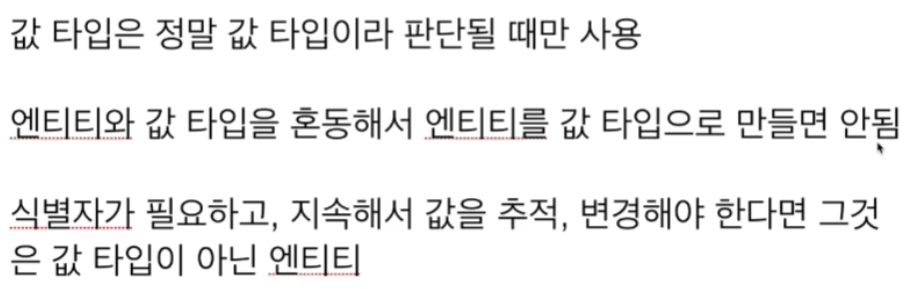


