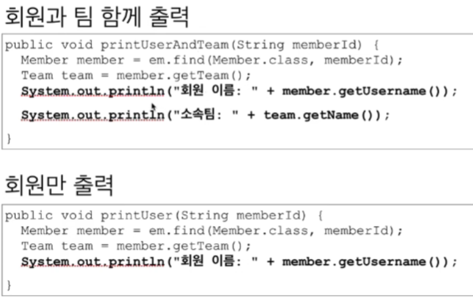
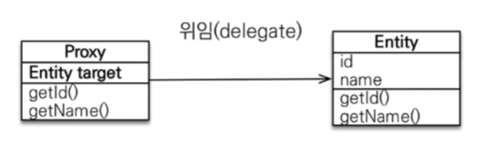
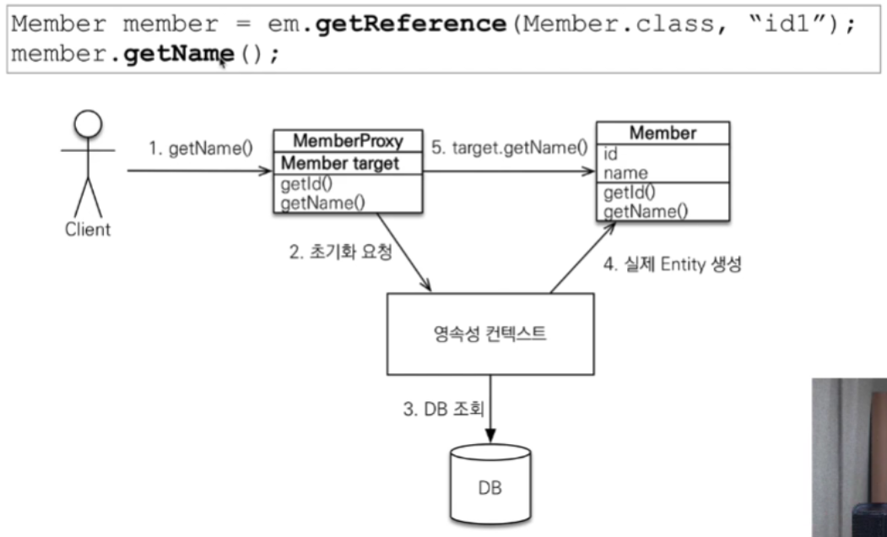

프록시
-


📌 레이지 로딩 
-
* [예제 참고](./sample/Run.java) 


* member 와 team 은 일대다 관계이다.
* 이때 member에 붙어있는 @ManyToOne 어노테이션의 fetch 전략 기본 값은 EAGER(즉시로딩)이다.
* 이 부분을 fetch = FetchType.LAZY 으로 바꿔줌으로써 Lazy Loading 전략으로 바꿀 수 있다.
```sql
    select
        umember0_.id as id1_21_0_,
        umember0_.team_id as team_id3_21_0_,
        umember0_.username as username2_21_0_ 
    from
        UMember umember0_ 
    where
        umember0_.id=?
멤버만 조회하는 경우
유저
팀도 함께 조회하는 경우
Hibernate: 
    select
        uteam0_.id as id1_23_0_,
        uteam0_.name as name2_23_0_ 
    from
        UTeam uteam0_ 
    where
        uteam0_.id=?
팀
6월 24, 2021 5:03:25 오후 org.hibernate.engine.jdbc.connections.internal.DriverManagerConnectionProviderImpl stop
INFO: HHH10001008: Cleaning up connection pool [jdbc:h2:tcp://localhost/~/test]

Process finished with exit code 0
```
* 유저를 먼저 조회하고, 뒤 늦게 team 이 필요할 때 데이터를 로딩 해온다는 것을 알 수 있다.
* 이게 가능한 이유는 최초 1회 member 를 조회했을 때, 내부의 team 데이터를 가짜인 프록시 객체로 가져오기 때문에 가능하다.


<br/>

📌 프록시를 가져오는 방법
-
* entityManager.find() : DB 또는 영속성 컨텍스트에서 Entity를 조회하는 메소드
* entityManager.getReference() : 데이터베이스의 조회를 미루는 가짜 엔티티인 프록시 객체를 조회
    ```java
    entityManager.flush();
    entityManager.clear();
    
    System.out.println("프록시 객체를 조회하는 경우");
    UMember newMember1 = entityManager.getReference(UMember.class, member.getId());
    ```
    * 위 처럼, 출력을 하지 않는 이상 값을 조회 하지 않음
    ```java
    Hibernate: 
        select
            uteam0_.id as id1_23_0_,
            uteam0_.name as name2_23_0_ 
        from
            UTeam uteam0_ 
        where
            uteam0_.id=?
    팀
    프록시 객체를 조회하는 경우
    ```

> getReference로 가져온 객체
* member의 클래스를 조회하면, member가 아닌 proxy 객체 임을 알 수 있다.
    ```java
    System.out.println("프록시 객체의 이름은 ? " + newMember1.getClass());
    ```
    * 결과
    ```text
    프록시 객체의 이름은 ? class Seventh.sample.UMember$HibernateProxy$4lGWJTYh
    ```
  
> proxy 객체의 동작 원리
* JPA 가 Entity를 감싼 프록시 객체를 반환한다. 이때 Entity를 참조할 수 있는 target 필드를 가지고 있고, 상속을 받았기 때문에 Entity 객체와 동일한 메서드를 가지고 있다.
* 그래서 Entity 변수로 프록시를 받을 수 있는 것이다.


> 프록시 객체의 정리
* 실제 클래스를 상속 받아서 만들어짐. 실제 Entity 객체가 아니다.
    * 이 것 때문에 Member 와 Type이 다르다. 타입 체크시에는 == 대신에 instance of 를 사용해야 합니다.
* 실제 클래스와 겉 모양이 같다. (상속)
* 사용하는 입장에서는 진짜 객체인지 프록시 객체인지 구분하지 않고 사용하면 됨 (이론상)
* Entity에 대한 참조(target)를 보관 => 프록시 객체를 호출하면 프록시가 진짜 엔티티의 메소드를 대신 호출해 줌


* 프록시 객체 동작
    
    * 프록시 객체를 통해서 getName을 호출하는 순간 DB에서 값을 가져와 Entity로 저장을 해둡니다.
    * 그리고 프록시 객체에 이 엔티티에 대한 참조를 저장합니다.
    * 이 후 엔티티의 getName 메소드를 호출합니다.
    * 이것은 JPA 표준은 아닙니다.

* 프록시 객체는 처음 사용할 때 한번만 초기화 된다.
* 프록시 객체를 초기화 한다고 해서 프록시 객체가 실제 엔티티로 변하는 것이 아니다. => 접근만 가능한 것이다.
* 영속성 컨텍스트에 찾는 엔티티가 이미 있으면 em.getReference()를 호출해도 실제 엔티티를 반환 합니다.
    * 1차 캐시에 있기 때문에
* 준영속 상태인 엔티티는 JPA의 도움을 받을 수 없기 때문에 초기화(값을 호출) 하려고 하면 문제가 발생합니다. (하이버네이트의 경우 Exception 을 반환) => 실무에서 이런 문제가 많이 발생합니다.
    * [참고](./proxy/Run.java)
    ```text
    객체를 초기화 하지 않은 상태에서 준영속 상태로 만듭니다.
    준영속 상태에서 초기화
    org.hibernate.LazyInitializationException: could not initialize proxy [Seventh.sample.UMember#2] - no Session
    	at org.hibernate.proxy.AbstractLazyInitializer.initialize(AbstractLazyInitializer.java:169)
    	at org.hibernate.proxy.AbstractLazyInitializer.getImplementation(AbstractLazyInitializer.java:309)
    	at org.hibernate.proxy.pojo.bytebuddy.ByteBuddyInterceptor.intercept(ByteBuddyInterceptor.java:45)
    	at org.hibernate.proxy.ProxyConfiguration$InterceptorDispatcher.intercept(ProxyConfiguration.java:95)
    	at Seventh.sample.UMember$HibernateProxy$jALDek90.getUsername(Unknown Source)
    	at Seventh.proxy.Run.main(Run.java:39)
    6월 24, 2021 5:40:33 오후 org.hibernate.engine.jdbc.connections.internal.DriverManagerConnectionProviderImpl stop
    INFO: HHH10001008: Cleaning up connection pool [jdbc:h2:tcp://localhost/~/test]
    ```
    
> 프록시 객체의 타입 비교 
```java
System.out.println("프록시로 가져온 객체와 일반 객체를 비교합니다");
UMember reference = entityManager.getReference(UMember.class, member.getId());

UMember normal = entityManager.find(UMember.class, member.getId());

System.out.println(normal.getClass() + ", " + reference.getClass()); // class Seventh.sample.UMember$HibernateProxy$z8ZYg544, class Seventh.sample.UMember$HibernateProxy$z8ZYg544

System.out.println(normal == reference); // true 반환
```
* [참고](./compare/Run.java)
* normal 객체와 아직 값을 가져오지 않은 reference 객체를 비교 했을 때 true를 반환합니다.
* JPA 의 경우, 같은 PK의 프록시 객체가 이미 영속성 컨텍스트에 있다면 초기화 하는 시점에 엔티티를 가져오고 프록시 객체에 참조값을 둔다.
    * 그리고 난 다음, 같은 엔티티에 대해 조회가 일어나면 프록시 객체를 반환한다.
    * 만약 프록시 객체 생성 이전에 이미 같은 키값의 엔티티가 있다면 프록시 객체 대신에 일반 객체를 반환한다.
* 이는 JPA 가 어차피, 객체를 키값으로 관리하고 있기 때문에 가능한 일이며 == 비교를 할 수 있도록 같은 pk의 객체이면 DB 

> 유틸을 통한 강제 초기화
* EntityManagerFactory 에서 유틸을 가져다가 사용할 수 있는데, 프록시 객체가 로드 상태인지 확인할 수 있음
    * [참고](./util/Run.java)
    ```text
    아직 초기화 되지 않았습니다
    false
    Hibernate: 
        select
            umember0_.id as id1_21_0_,
            umember0_.team_id as team_id3_21_0_,
            umember0_.username as username2_21_0_ 
        from
            UMember umember0_ 
        where
            umember0_.id=?
    true
    6월 25, 2021 4:28:35 오후 org.hibernate.engine.jdbc.connections.internal.DriverManagerConnectionProviderImpl stop
    INFO: HHH10001008: Cleaning up connection pool [jdbc:h2:tcp://localhost/~/test]
    
    Process finished with exit code 0
    ```
* Hibernate 는 강제로 초기화 하는 메소드를 제공합니다.
    ```java
    UMember newReference = entityManager.getReference(UMember.class, member.getId());
    
    System.out.println("강제로 초기화 하는 방법입니다.");
    Hibernate.initialize(newReference);
    ```
  
<br/>

📌 Loading Mode 실전
-
* JPA는 EAGER 를 구현하기 위해서 두가지 방법으로 구현할 수 있다. (엔티티가 2개라고 가정한다.)
    1. join 을 통해서 한번에 가져오는 방법 
    2. 쿼리를 2번 날려서 각각 가져오는 방법

> EAGER 로딩을 사용할 때 문제점
* EAGER 로딩은 JPA 를 통해서 find 로 엔티티를 조회할 경우 join 을 통해서 객체를 한번에 가져온다.
* 그런데 JPQL을 통해서 가져올 경우 먼저 쿼리를 만들어서 날린다. 이 때 JPA는 EAGER 로딩을 보장하기 위해서, EAGER 로 설정된 연관 엔티리를 조회하기 위해 다시 DB를 다녀온다.
    * 만약 JPQL 으로 날린 쿼리가 가져온 Entity의 수가 N 개라고 가정을 하면, DB에는 N (모두 다 다른 객체를 가져올 때) 번의 쿼리를 더 날려야 한다.
    * 이 문제를 해결하는 방법으로 다음과 같은 3가지 방법이 있다. 
        * 패치 조인을 통해서 한번에 load 해오는 방법
        * 배치 사이즈를 통해서 DB 조회 쿼리를 한번에 모아 가져오는 방법
        * 엔티티 그래프란 어노테이션으로 푸는 방법
        
> Loading Mode 정리
* 가급적 지연 로딩만 사용 (특히 실무에서)
* 즉시 로딩을 사용하면 예상치 못한 SQL 이 발생
* 즉시 로딩은 JPQL 에서 N + 1 문제를 일으킨다.
* @ManyToOne, @OneToOne 은 기본이 즉시 로딩이므로, Lazy 로딩으로 별도 설정을 해주어야 한다.
* @OneToMany, @ManyToMany 는 기본에 지연 로딩
* 이론적으로는, 한번에 사용할 일이 많은 엔티티이면 즉시로딩으로(네트워킹 비용을 줄이기 위해서), 아니라면 지연 로딩으로 사용하는 것이 맞으나, 어디에서 JPQL 을 사용할지는 모르는 일이다.
    * 따라서 무조건 Lazy Loading 을 사용하는 것이 맞다.


<br/>
    
    
