📌 상속관계의 매핑
-
* 관계형 DB는 상속 관계라는 개념이 없음 
* 슈퍼 타입과 서브타입이 객체의 상속의 개념과 비슷하긴 함 
* 따라서 상속은 슈퍼 타입과 서브 타입의 관계를 상속 관계로 사용하고 있음

> DB에서 슈퍼타입과 서브타입 모식도

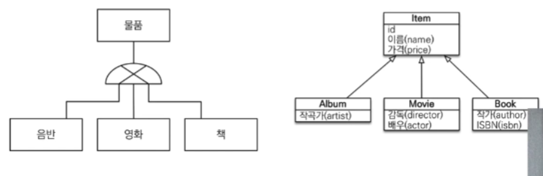

> 슈퍼타입과 서브타입을 나타내는 전략

3가지 전략이 존재
* join 전략
    * 공통의 필드는 별도의 테이블에 모아두고, Dtype으로 식별한다. 
    * 서브타입 테이블에 슈터타입에 대한 fk 존재
    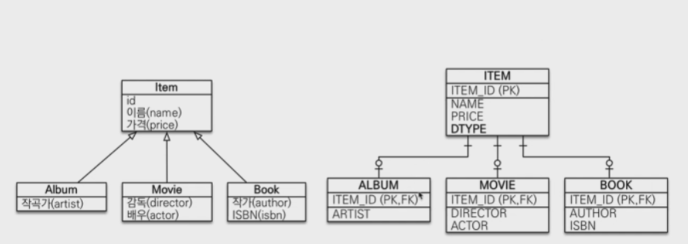
    
* 단일 테이블 전략
    * 하나의 테이블에 모든 값을 두고 Dtype 하나만으로 객체를 식별하는 방법
    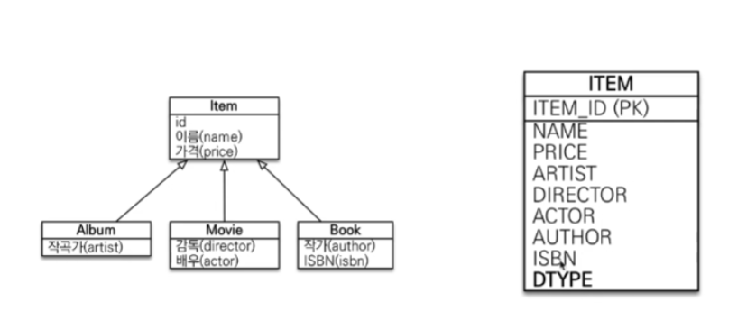
    
* 구현 클래스마다 테이블 전략
    * 서브타입 1개 마다 하나의 테이블을 만드는 전략
    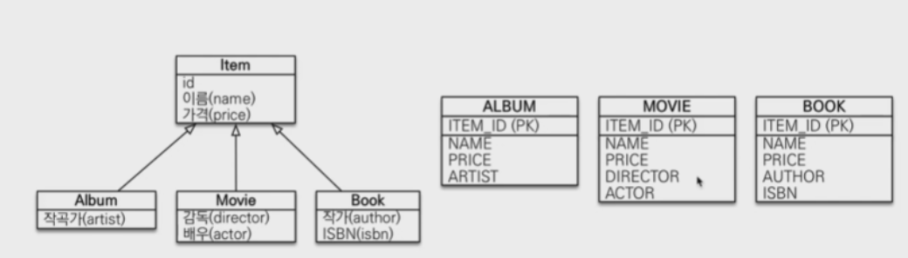
    * 시퀀스는 1개를 돌려서 사용한다. 

> 전략 구현 방법 (어노테이션)
* @inheritance(strategy=InheritanceType.XXXX) : 클래스 위에 사용
    * JOINED : 조인 전략
    * SINGLE_TABLE : 단일 테이블 전략
    * TABLE_PER_CLASS : 구현 클래스마다 테이블 전략
* @DiscriminatorColumn(name = "DTYPE") : 클래스 위에 사용 (DTYPE 구분이 필요한데, 이름을 변경하고 싶은 경우)
* @DiscriminatorValue("XXX") : DTYPE 내부에 들어갈 값을 명시하고 싶은 경우 사용 (기본 : 테이블 이름)


* 조인 전략 : [Run.java](./join/Run.java)
    * book 에 값을 저장해도 item에 저장 됨
    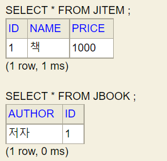
    * 비지니스 적으로 많이 사용할 경우 조인 전략을 구사하면 좋음
    * 테이블이 두개로 나뉘어 있음을 알 수 있음
    * 이때 book 은 pk가 fk 임을 알 수 있다.
    * DTYPE을 사용하고 싶은 경우 @DiscriminatorColumn 태그를 함께 사용하면 됨 (이는 운영에서 어떤 테이블의 데이터에 의해 INSERT 되었는지 알기 위해서 넣어주는 것이 좋음)
    * 장점 
        * 테이블에 값이 정규화 되어 들어가 있음 => 체계적으로 정리가 잘 된 데이터
        * 외래키 참조 무결성 제약조건을 활용할 수 있음 (NULL X, 유효한 데이터)
        * 저장 공간의 효율성 => 이 만큼 성능은 높아짐
    * 단점
        * 조인을 많이 사용하는 점은 오히려 성능을 떨어트릴 수 있음 => 그러나 조인으로 인한 성능 저하는 그닥 크지 않을 수 있음
        * 조회 쿼리가 복잡하다.
        * 데이터 저장시 INSERT 2번 호출 => 그닥 큰 단점은 아님

* 단일 테이블 전략 : [Run.java](./join/Run.java)
    * @Inheritance(strategy = InheritanceType.SINGLE_TABLE) 
    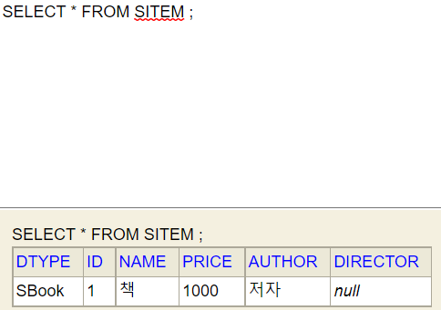
    * 보면 item을 상속 받은 movie 의 필드인 director는 비어있고, DTYPE은 DiscriminatorColumn 이 없음에도 기본적으로 들어가있다.
        * 데이터를 구분할 수 있는 유일한 컬럼이 DTYPE 이기 때문이다.
    * 그리고 테이블은 item 하나만 생겼음을 알 수 있다. 
    * 한편 item은 단독으로 사용할 일이 없다면 abstract 로 추상 클래스로 만들어주는 것이 맞다.
    * movie entity 에 값을 insert 할 때 movie 에 값이 들어가 있는 것이 특징적이다.
    * 조인 테이블 전략과 비교 했을 때 어노테이션 하나만 바뀌었을 뿐인데 동작을 한다는 것이 특징적이다.
    * 장점
        * 조인이 적어 성능이 비교적 좋음 
        * 조회 쿼리가 단순하다.
    * 단점 
        * 지식 엔티티가 매핑한 컬럼은 모두 null 을 허용해주어야 함
        * 단일 테이블에 모든 것을 저장하기 때문에 테이블이 커질 수 있음. 상황에 따라서 조회 성능이 오히려 느려질 수 있음(그런데 임계점을 넘을일이 많지 않음)

* 구현 클래스마다 전략 : [Run.java](./per/Run.java)
    * @Inheritance(strategy = InheritanceType.TABLE_PER_CLASS) 
    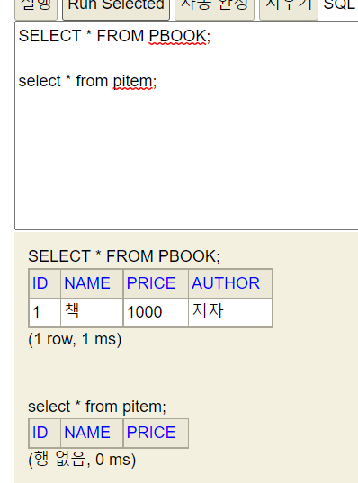
    * item 을 사용할일이 없기 때문에 무조건 abstract 로 해주어야 합니다. => 그렇지 않을 경우 테이블이 생김
    * 그리고 객체 지향이기 때문에 item 으로 받을 수 있어야 하는데 이것으로 받으면 아래와 같이 모든 테이블을 union으로 전부 뒤진다.
    ```sql
        select
            pitem0_.id as id1_7_0_,
            pitem0_.name as name2_7_0_,
            pitem0_.price as price3_7_0_,
            pitem0_.author as author1_6_0_,
            pitem0_.director as director1_8_0_,
            pitem0_.clazz_ as clazz_0_ 
        from
            ( select
                id,
                name,
                price,
                null as author,
                null as director,
                0 as clazz_ 
            from
                PItem 
            union
            all select
                id,
                name,
                price,
                author,
                null as director,
                1 as clazz_ 
            from
                PBook 
            union
            all select
                id,
                name,
                price,
                null as author,
                director,
                2 as clazz_ 
            from
                PMovie 
        ) pitem0_ 
    where
        pitem0_.id=?
    6월 22, 2021 2:38:57 오후 org.hibernate.engine.jdbc.connections.internal.DriverManagerConnectionProviderImpl stop
    INFO: HHH10001008: Cleaning up connection pool [jdbc:h2:tcp://localhost/~/test]
    
    Process finished with exit code 0
    ```
    * 장점
        * sub 타입을 명확하게 구분하여야 할 때만 효과적
        * not null 조건을 사용할 수 있음
    * 단점
        * 여러 자식 테이블을 함께 조회할 때 성능이 느림
        * 자식 테이블을 통합해서 하나로 묶어야 할 부분이 있을 때 사용이 좋지 않음 
        * 변경의 관점에서 수정이 일어날 때 뜯어 고쳐야 할 부분이 많음 
    * 실무에선 사용해선 안된다.


<br/>

📌 공통 필드 묶기 (상속 이용 X)
-
* 테이블에는 수정자, 생성자, 생성일, 수정일 같은 필드를 공통적으로 가져야 하는 경우가 많음. 해당 필드를 한 클래스에 두고 상속해서 물려 받는 형식으로 구현할 수 있는데 이 때 부모클래스는 @MappedSuperclass 으로 선언된 클래스이여야 한다.
* 상속 받을 필드가 있는 클래스에 @MappedSuperclass 어노테이션을 두고 MItem 에서 상속 받으면 됩니다.
* 그리고 이때 @MappedSuperclass 로 선언된 클래스는 되도록 abstract 으로 선언해서 사용하자 => 개발자 실수 방지 용도

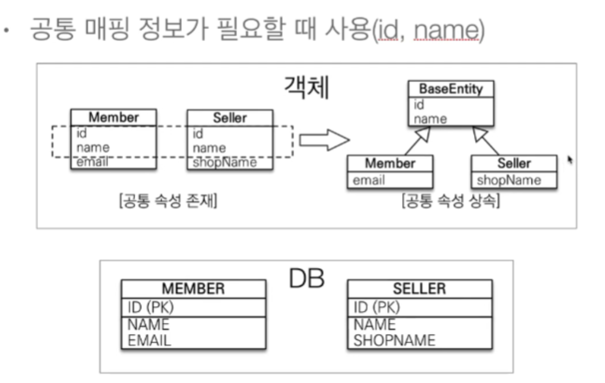

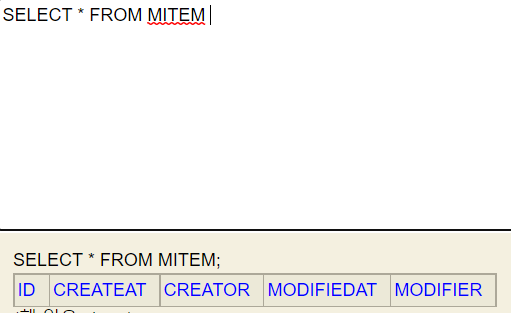
* [MItem.java](./mapped/MItem.java)
* 보통 위에 들어가는 필드 값은 interceptor 나 event 등으로 값을 setting 해주곤 한다.
* 상속관계 매핑이 아닙니다.
* 엔티티가 아닙니다. 테이블과 매핑되지도 않습니다.
* 이 클래스를 상속 받는 자식 클래스에 메핑 정보를 전달하기 위함입니다.
* 조회, 검색 불가(em.find(BaseEntity) 불가)
* 공통 정보를 모을 때만 사용

<br/>

📌 정리
-
* Entity 가 상속 받을 수 있는 클래스는 @MappedSuperclass 또는 @Entity 클래스 밖에 없다.


<br/>

📌 실전 요구사항
-
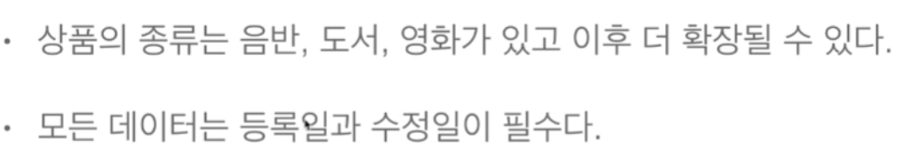
* 확장 될 수 때문에 조인 전략으로 상속 받는게 좋지만, 심플함을 유지하기 위해서 단일 테이블 전략으로 구현한다.
* 아래 요구 사항은 MappedSupperclass 가 필요할 것으로 보인다. 

> 도메인 모델

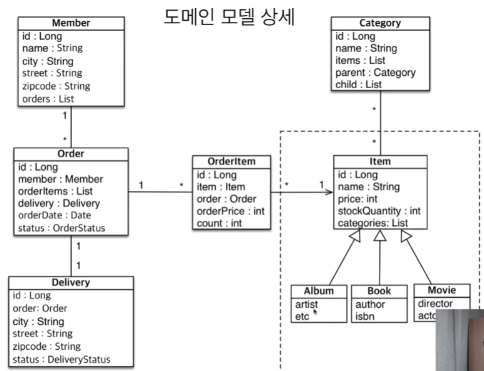

> 테이블 설계

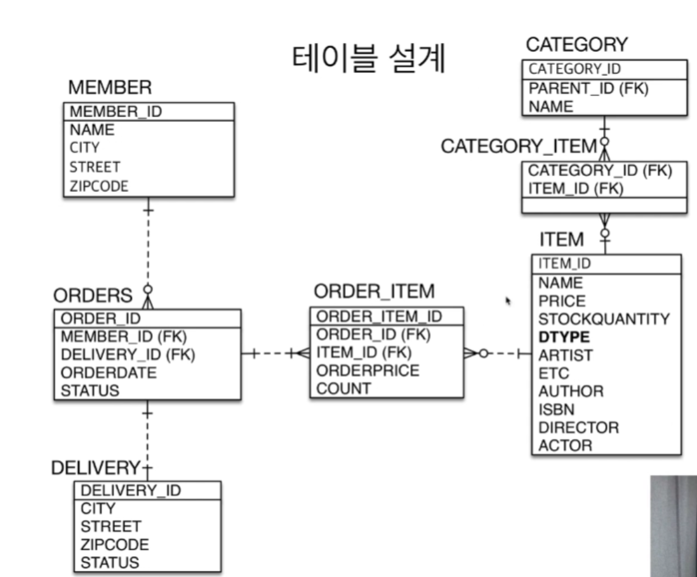
* item 테이블만 단독으로 사용할 일이 없기 때문에 아래와 같이 abstract로  추상 클래스로 변경해주었다. 

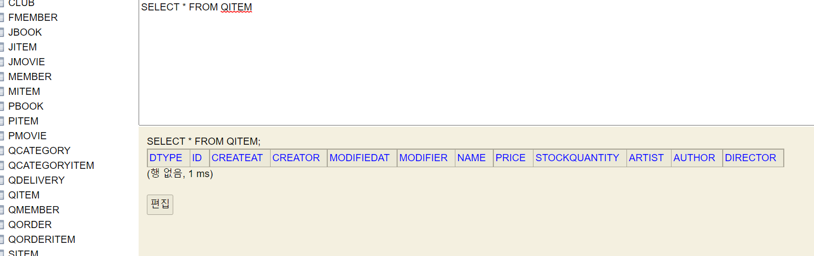
* movie나 album 등의 테이블은 없고, item에 모든 필드가 다 있는데 DType 또한 있다. 그리고 createAt 같은 BaseEntity의 필드가 들어있다.
