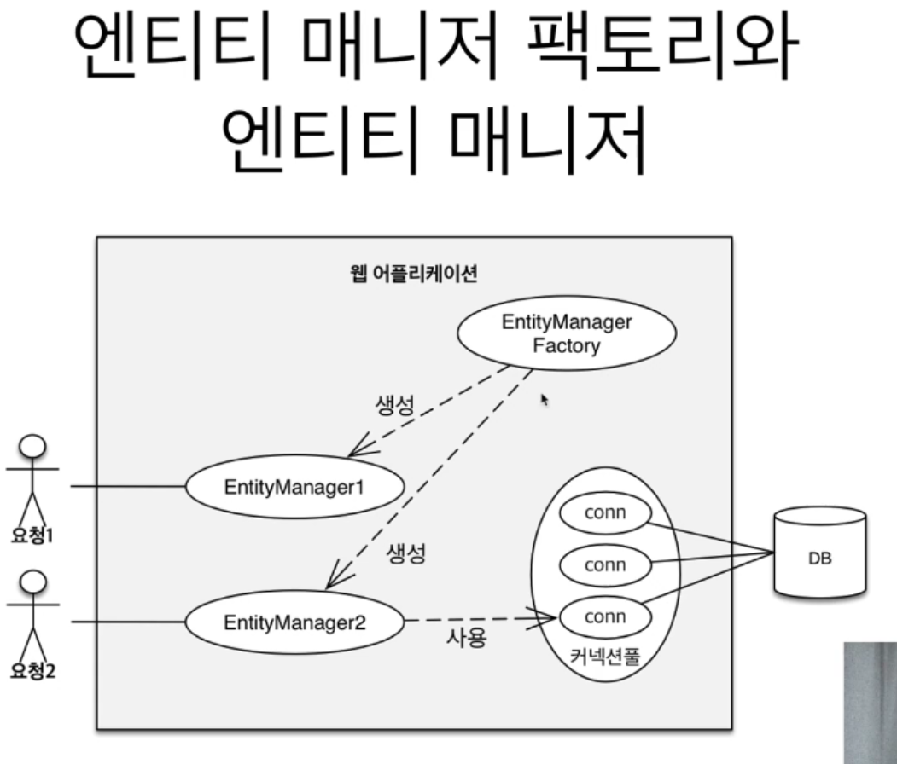
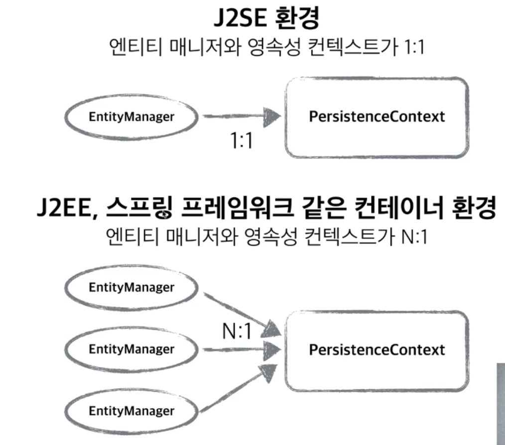
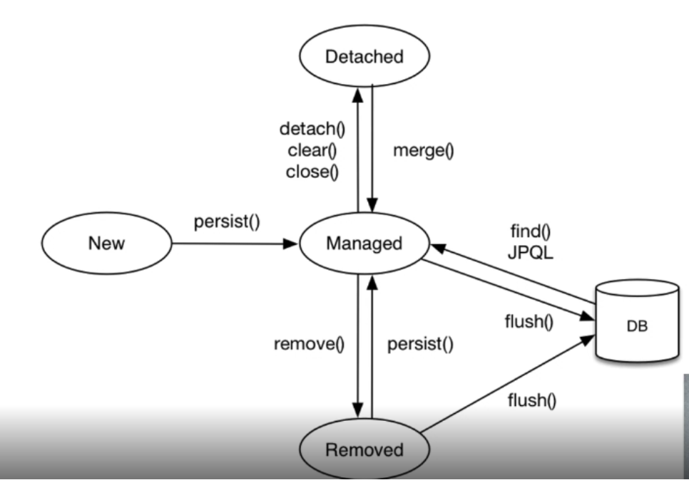
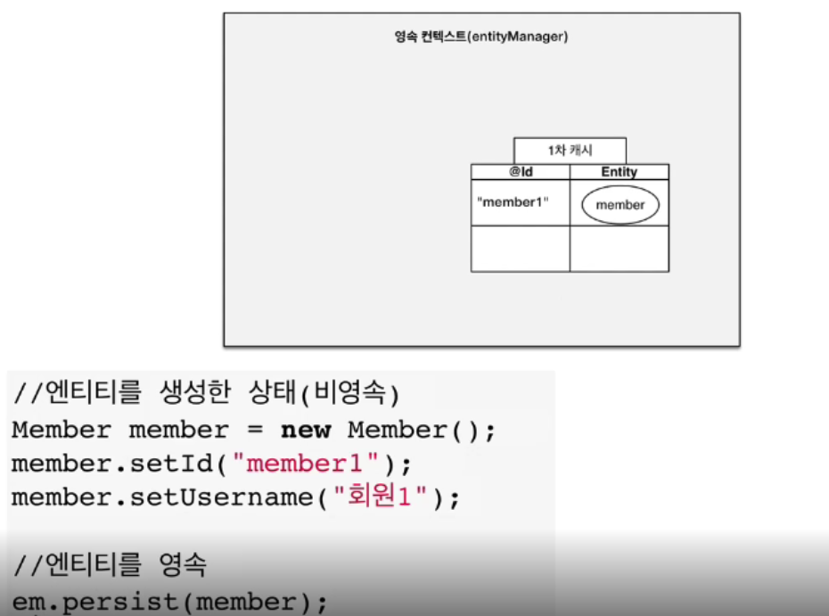
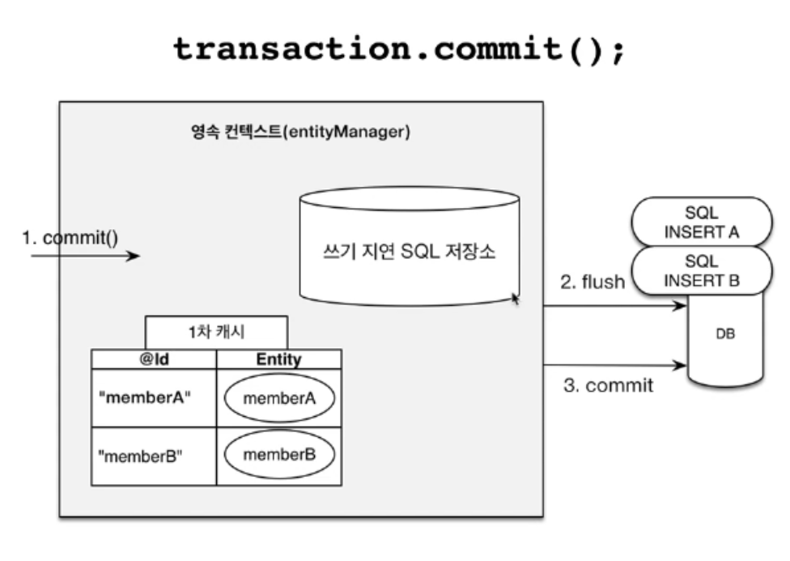
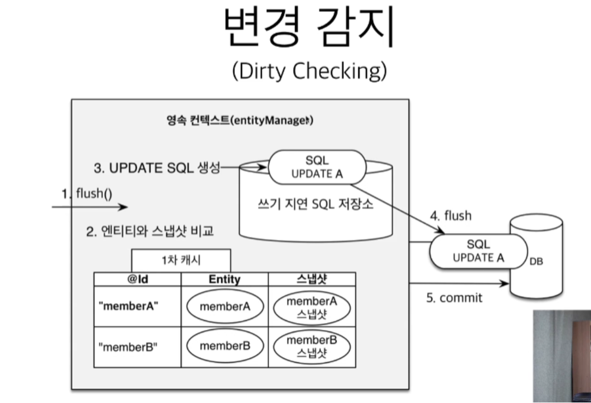

📌 영속성 컨테이너란?
-
* JPA 이해를 위해 가장 중요한 용어
* 엔티티를 영구히 저장하는 환경 이라는 뜻
* 앞에서 봤던 EntityManager.persist 메소드는 사실, DB에 저장하는 것이 아니라, 영속성 컨테이너에 저장하는 메소드이고 commit 시 영속성 컨테이너에 저장된 sql을 DB에 뿌려주는 형식이다.
* 영속성 컨테이너는 논리적인 개념


<br/>

📌 영속성 컨테이너 원리
-

* 고객의 요청이 올 때마다, EntityManagerFactory 에서 EntityManager를 생성해서 가져온다.
* 그리고 EntityManager가 커넥션 풀에서 connection 을 가져와 사용한다.
* EntityManager가 영속성 컨테이너라는 곳에 엔티티 객체를 저장한다


* 보통 EntityManager 1개당, 하나의 영속성 컨테이너에 접근하기 때문에 기본적으로는 영속성 컨테이너를 공유하지 않지만, 스프링 프레임워크에선 영속성 컨텍스트를 공유하기도 한다.
* 단, 1차 캐시는 EntityManager가 소멸함과 동시에 사라지기 때문에 위에서 말하는 영속성 컨테이너는 2차 캐시를 의미한다.


<br/>

📌 엔티티의 생명주기
-
* 비영속 (new/transient)
    * 영속성 컨텍스트와는 전혀 관계가 없는 새로운 상태 (엔티티 객체를 새로 생성)
* 영속 (managed)
    * 영속성 컨텍스트에 관리되는 상태 (persist 된 상태)
* 준영속 (detached)
    * 영속성 컨텍스트에 저장 되었다가 분리된 상태
* 삭제 (removed)
    * 삭제된 상태



> 비영속
```java
First.Member member = new First.Member();
```

> 영속
```java
First.Member member = new First.Member();
entityManager.persist(member);
```
아직은 DB에 저장된 상태가 아니다.

> 준영속
```java
entityManager.detach(member);
```
영속성 컨텍스트의 관리 상태에서 벗어났다.

> 삭제
```java
entityManager.remove(member);
```
DB에서 삭제가 되었다.

> 영속성 컨테이너를 비우는 방법
```java
entityManager.clear();
```
* 이렇게 컨테이너를 비워버리면, 1차 캐시에 값이 사라지기 때문에 set을 하여 엔티티를 수정해도 업데이트 쿼리가 나가지 않는다.
* 마찬가지로 이미 조회한 값도 다시 DB에 SELECT 쿼리를 날리게 된다.


<br/>


📌 영속성 컨테이너 이점
-
* 영속성 컨테이너를 사용함으로써 얻는 이점은 다음과 같다.
    * 1차 캐시
    * 동일성 보장
    * 트랜젝션을 지원하는 쓰기 지연
    * 변경 감지
    * 지연 로딩

> 1차 캐시 
* 영속성 컨텍스트에는 별도의 저장소가 있다. 값을 조회할 때 영속성 컨테이너에 값이 있다면 그것을 가져올 것이다. 

* SELECT할 때 1차 캐시에 값을 저장한 뒤에 Entity를 가져오고 INSERT 할 때에는 1차 캐시에 엔티티를 저장했다가 SELECT 한다. 그렇기 때문에 이 후 같은 객체를 SELECT 하면 DB에 갔다오지 않는다.

> 동일성 보장
* 같은 데이터의 객체는, 같은 주소를 가지도록 보장 (이것은 1차 캐시에서 가지고 있던 것의 주소만 가져오기 때문이다)

> 트랜젝션을 지원하는 쓰기 지연
* INSERT 문이 반복 될 때 COMMIT 시점에 한번에 쿼리가 날아감 (단, ID의 생성전략이 IDENTITY가 아닌 경우)
* persist 가 일어나는 시점에 1차 캐시에 저장을 함과 동시에 "쓰기 지연 SQL 저장소" 에 저장을 해둔다.

* 그리고 커밋이 일어나는 시점에 flush가 일어나면서 DB에 SQL이 날아가고, commit 메소드를 호출해서 커밋한 뒤 마무리를 한다.


* 지연로딩이 일어나는 쿼리의 수를 persistence.xml 의 설정을 변경함으로써 변경할 수 있다.
```xml
<property name="hibernate.jdbc.batch_size" value="10"/>
```

> 변경 감지
* JPA에는 update 같은 코드가 없다. 단, 객체의 값을 수정했을 때 커밋하는 시점에 자동으로 update 쿼리가 날아간다. 이런 동작이 가능한 이유는 다음과 같은 원리 때문이다.

* Entity 를 영속성 컨테이너에 persist 하는 순간 1차 캐시에 엔티티를 저장함과 동시에 스냅샷을 별도로 저장을 해둔다.
* set 이 일어나면 엔티티의 값이 변경 되고, flush가 일어나는 시점에 JPA는 스냅샷과 Entity의 현상태를 비교 후 변경이 있으면 쓰기 지연 SQL 저장소에  쿼리를 하나 생성해서 같이 날리는 것이다.


> 지연 로딩
* 별도로 저장소를 운영하기 때문에 flush 하는 시점에 한번에 쿼리를 만들어 날릴 수 있다. 
* 어차피 DB의 Isolation Level은 Read Commit (트랜젝션 커밋 전까지 다른 트랜젝션에서 접근 불가) 이기 때문에 커밋 이전에만 쿼리를 날리면 되기 때문에 문제가 없다.
* 즉, JPA를 사용하여도 동기화에 대한 이슈는 없다.


<br/>


📌 flush 란?
-
* DB에 쿼리를 날리는 작업으로 JPA에서는 "쓰기 지연 SQL 저장소"에 저장된 SQL을 DB에 실행하는 것을 의미한다.
* 영속성 컨텍스트의 값과 DB의 상태를 맞춰주는 것이다.

> flush 발생시 일어나는 일
* 변경 감지
* 수정된 엔티티를 쓰기 지연 SQL 저장소에 등록
* 이 후 쿼리를 DB로 전송 (등록, 수정, 삭제)
* 그리고 commit 되면 결과가 DB에 반영

> 영속성 컨테이너가 flush 되는 시점
* 직접 flush를 호출한 경우
    ```text
    entityManager.flush();
    ```
* 트랜젝션을 커밋한 경우 (flush 자동 호출)
    ```text
    entityManager.commit();
    ```
* JPQL 쿼리 실행 (flush 자동 호출)
    ```text
    List<First.Member> memberList = entityManager.createQuery("select m from First.Member as m", First.Member.class).getResultList();
    ```
    * 이때 자동으로 flush가 호출되는 이유는 JPQL의 경우 무조건 DB를 거쳐서 가져오는 데이터이기 때문이다.
    * 만약 방금 insert 된 값이 DB에 flush 되어 있지 않다면 select 할 때 값이 없을 수 있는데 이는 데이터를 신뢰할 수 없음을 의미하기 때문이다.

> flush 모드 옵션
* JPQL 을 사용할 때 굳이 Flush 를 사용하고 싶지 않으면, 이렇게 할 수 있다.

```java
entityManager.setFlushMode(FlushModeType.COMMIT);
```
* FlushModeType.AUTO
    * 커밋이나 쿼리를 실행할 때 플러시 (기본값)
* FlushModeType.COMMIT
    * 커밋할 때만 플러시

그런데 되도록 기본값을 사용하는 것이 좋다.
그리고 이런 플래시는 컨텍스트를 비우는 것이 아니다. 컨텍스트를 비우고 싶다면 clear 를 사용해야 한다.


