객체 지향 쿼리 언어 JPQL
-

📌 관련 라이브러리
-
* JPA Criteria
    * JPQL 을 쉽게 사용할 수 있도록 하는 동적 JPQL Generator
* QueryDSL
    * JPQL 을 쉽게 사용할 수 있도록 하는 동적 JPQL Generator
* 네이티브 SQL
    * SQL을 직접 날리는 것 
* JDBC API
    * JPQL로 안되는 것이 간혹 있는데 그럴 때 네이티브 SQL 보단 JDBC template 같은 것을 사용

 

📌 JPQL 을 사용하는 상황
-
* 나이가 18 살 이상인 회원을 모두 검색하고 싶은 경우 => 동적으로 where 조건을 달아주어야 함 

 

📌 네이티브 쿼리 대신 JPQL 을 사용하면 얻는 장점
-
* JPQL은 엔티티 객체를 중심으로 개발을 진행하기 때문에 객체 중심적이다.
* 검색 쿼리를 만들때에도 테이블이 아닌, 엔티티 객체를 대상으로 검색 
* 모든 DB 데이터를 객체로 변환해서 검색하는 것은 불가능 
* DB에서 부터 데이터를 간추리려고 한다면 결국 SQL을 사용해야할 수 도 있음 

 

📌 JPQL 특징
-
* JPA 는 SQL 을 추상화한 JPQL 이라는 객체 지향 쿼리 언어를 제공
* SQL과 문법이 유사. select, from, where, group by, having, join 지원
* JPQL은 엔티티 객체를 대상으로 쿼리
* SQL은 데이터베이스 테이블을 대상으로 쿼리
* 따라서 특정 DB에 의존하지 않는 쿼리라는 말
    * 한마디로 객체지향 쿼리

📌 JPQL 맛보기
-
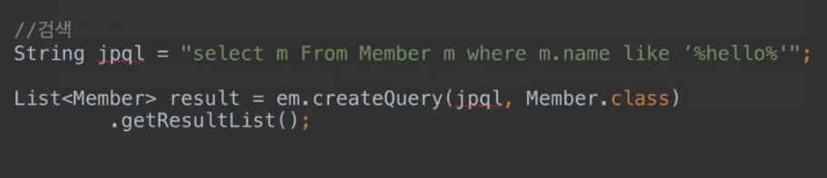
* Entity class 인 Member를 m으로 aliasing 하고 해당 값을 그대로 조회 ⇒ 엔티티를 조회해서 쿼리로 만듬 

 

📌 JPA Criteria 소개 & 사용하지 말아야 할 이유
-
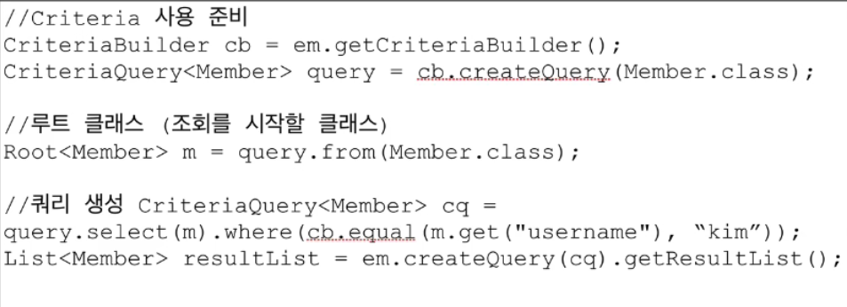
* jpql 은 결국 String 이기 때문에 동적 쿼리 생성이 매우 어렵다.
* 그래서 대안으로 나온 것이 Criteria 이고 이는 JPA 표준 스펙이나, 단점은 sql 스럽지 않아서 알아보기가 어렵고 유지보수가 어렵다. 운영할 때는 운영하기가 거의 불가능할 정도로 어렵다고 한다. ⇒ 디버깅 어렵다네요
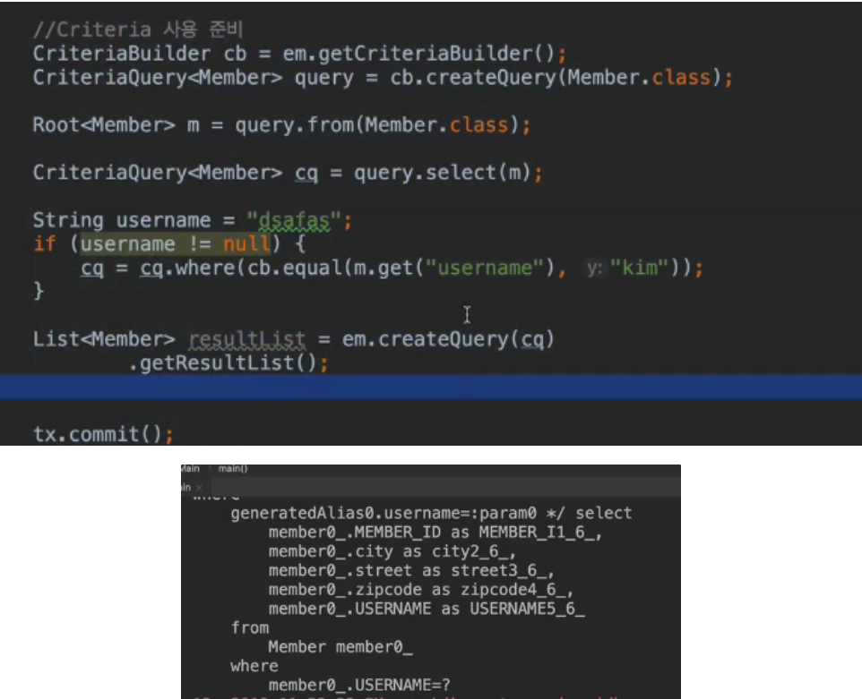
* JPQL 빌더 역할이고 자바코드로 JPQL을 작성할 수 있다는 특징이 있으나, 복잡하고 실용성 없음
* QueryDSL (오픈소스 라이브러리) 사용을 권장합니다.

 

📌 QueryDSL 소개
-
* 코드
    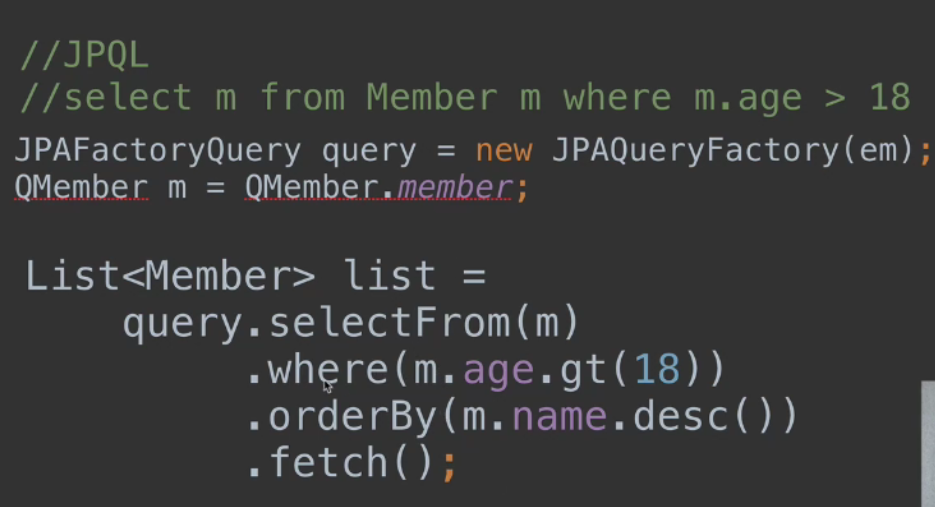
* 문자가 아닌 자바코드로 JPQL을 작성할 수 있음
    * 컴파일 시점에 문법 오류를 찾을 수 있음
* JPQL 빌더의 역할
* 동적 쿼리 작성이 편리함
* 단순하고 쉬움
* 실무 사용을 권장

 

📌 QueryDSL 공식 문서
-
* <http://querydsl.com/>
* 정산 하는 부분이 시스템에 있다면 QueryDSL 을 거의 필수적으로 사용하는게 좋음
* 공식 문서가 워낙 잘 되어 있다보니 JPQL 에 대한 이해만 있다면 QueryDSL은 쉽게 사용이 가능

 

📌 네이티브 SQL 소개
-
* JPA가 제공하는 SQL을 직접 사용 가능
* JPQL로 해결할 수 없는 특정 DB에 의존하는 기능을 사용하기 위함
    * ex) 오라클의 connect by 등
* 코드
    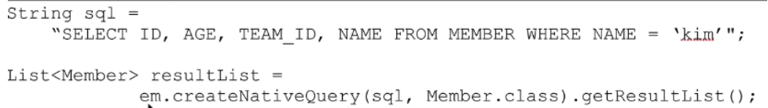
    
 

📌 JDBC Template
-
* JPA 를 사용하면서, JDBC 커넥션을 직접 사용하거나, JDBC Template, MyBatis 등을 함께 사용
* 단, 영속성 컨텍스트를 적절한 시점에 강제로 flush 해야 합니다.
    * JDBC Template에서 select 할 때, 없는 값에 대해 select 할 가능성이 있기 때문

 
    
📌 JPQL 소개
-
* 엔티티를 대상으로 하는 쿼리 언어
    * 객체 지향 쿼리 언어
* JPQL은 SQL을 추상화 했기 때문에 특징 DB에 의존하지 않습니다.
* 결국은 SQL로 변환 됩니다.
* 기본적으로 JPQL으로 select 한 엔티티는 영속 상태이기 때문에 setter로 값을 수정하면 update 쿼리가 나갑니다.

 

📌 JPQL 문법
-
* select m from Member as m where m.age > 18
* 엔티티와 속성은 대소문자를 구분(Member, age)
* JPQL의 키워드는 대소문자 구분 X (select, from, WHERE)
* 테이블 이름이 아니라, 엔티티 이름으로 쿼리를 수행
* 별칭은 필수(m). as는 생략 가능
* 아래와 같은 표준 문법은 모두 지원 됨
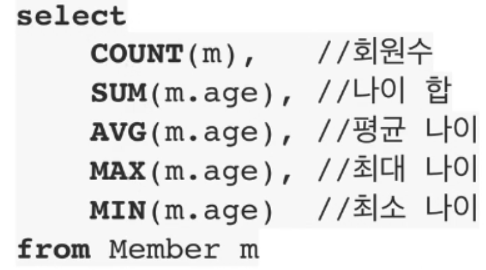

 

📌 사용 예제
-
* [참고](./usage/Run.java)        

 

📌 JPQL 에서 Entity를 받을 때
-
* [참고](./usage/Run.java)     
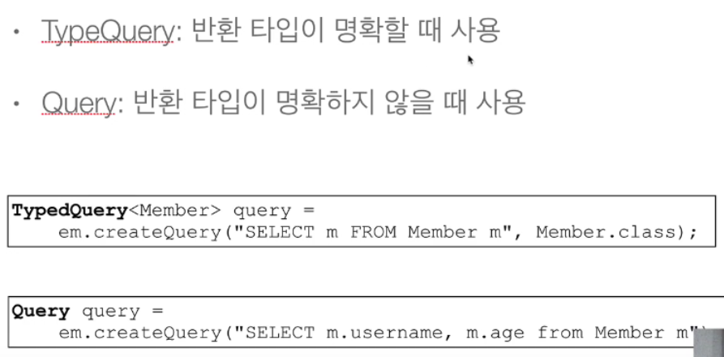

 

📌 getResultList vs getSingleResult
-
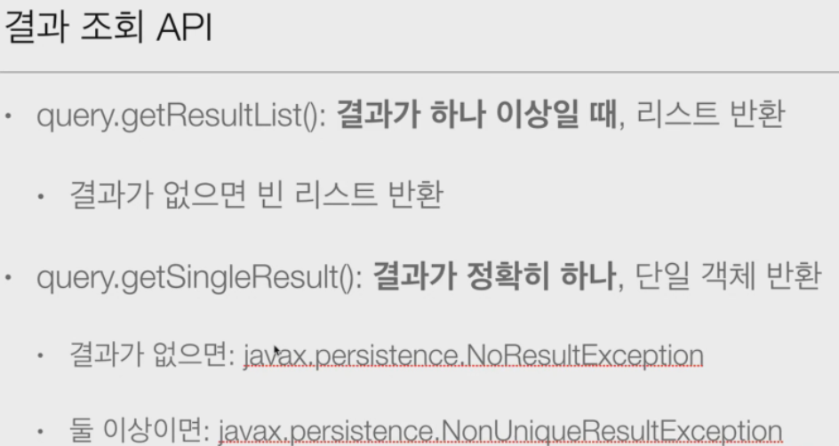

 

📌 JPQL의 파라미터 바인딩
-
* [참고](./param/Run.java)    
* 위치 기준 파라미터 바인딩은, 값이 하나 추가 되었을 때 개발자가 실수하면 다른 파라미터의 setting  위치가 하나씩 다 밀리기 때문에 되도록 사용하지 않는 것을 권장
* 실전에선 다음과 같이 chaining 기법으로 사용
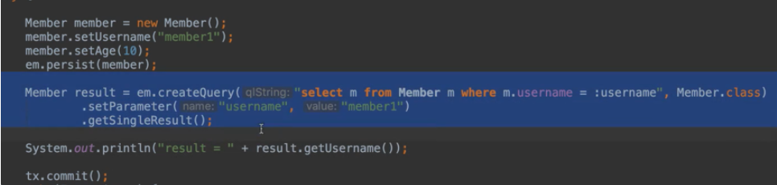

 

📌 프로젝션
-
* JPQL 에서 select 할 대상을 지정하는 것 
* 프로젝션 대상
    * 엔티티
    * 임베디드 타입
    * 스칼라 타입(문자, 숫자 등의 기본 타입)
* select m from Member m : 엔티티 프로젝션
* select m.team from Member m : 엔티티 프로젝션
    * member 와 team 은 다대일 관계인데, Member를 통해 team 을 조회하기 때문에 자동으로 join을 할 것이고 이를 묵시적 join이라고 합니다.
    * 그러나 묵시적 조인은 사용하지 않는 것이 좋습니다 => 쿼리 튜닝과 관계가 있음
* select m.address from Member m : 임베디드 프로젝션
* select m.age from Member m : 스칼라 프로젝션

 

📌 프로젝션 별로 값을 받는 방법
-
* [참고](./get/Run.java)
* 프로젝션을 받는 다양한 방법
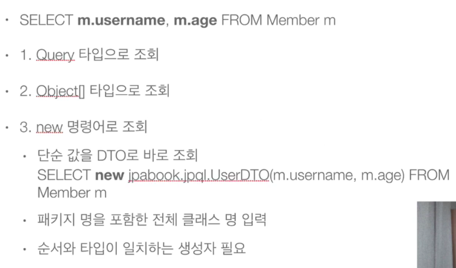
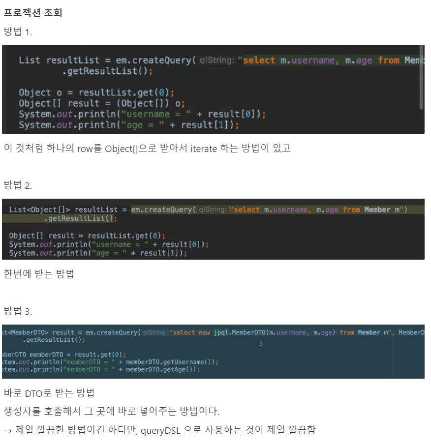

    
    
